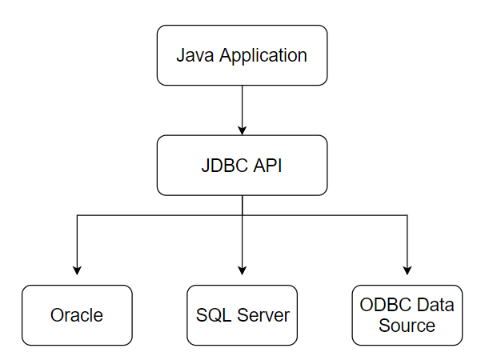

# 第5章 JDBC

## JDBC简介

> JDBC（Java DataBase Connectivity）
>
> sun公司提供一套执行SQ语句的API（接口或类），主要是由**接口**组成，可以为关系型数据库提供统一访问；
>
> sun为简化数据库开发定义一套JDBC接口，这些接口由数据库的厂商去实现；
>
> 对于开发人员只需要关心JDCB接口，并通过JDBC加载驱动即可操作相应的数据库；


## JDBC相关jar包

1. 包：java.sql
2. 包：javax.sql
3. 数据厂商驱动包


## JDBC工作原理




## 入门案例

> 实现学生表数据查询；

### 操作数据库步骤

1. 通过Driver Manager加载驱动；

2. 通过连接对象（连接URL，用户名，密码）

3. 通过Statement对象执行sql语句；

4. 处理返回的结果

5. 释放资源

   

## 常见API

### DriverManager类

- 管理一组JDBC驱动的基础服务

- JDBC中的DriverManager用于加载驱动，创建数据库的连接

```java
//加载驱动
//1.1 使用registerDriver方法
  //缺点:实例化了两个Driver对象;产生对某个驱动类的依赖,Class可以动态修改
DriverManager.registerDriver(new Driver());
//1.2 使用Class.forName方法,建议使用
Class.forName("com.mysql.jdbc.Driver");

//Driver类中的实现:
static {
    try {
        java.sql.DriverManager.registerDriver(new Driver());
    } catch (SQLException E) {
        throw new RuntimeException("Can't register driver!");
    }
}
```

### Connection类

- 代表数据库的连接，是JDBC非常重要的对象，客户端与数据库之间的交互的完成需要借助于

- 常见方法：

  ```java
  createStatement();      //创建向数据库发送sql指令的Statement对象
  prepareStatement();     //创建向数据库发送预编译sql的preparedStatament对象
  setAutoCommit(boolean); //设置事务是否自动提交
  commit();               //提交事务
  rollback();             //回滚事务
  ```

- 获取数据连接

  ```java
  Connection conn = DriverManager.getConnection(url, user, password);
  /*参数:
    URL:提供连接数据的方法，可以使相应的驱动能够识别数据库并建立连接
       例如:jdbc:mysql://localhost:3306/mydb
  协议:子协议://ip:端口/数据库
  user:数据库的用户名或者模式名称
  password:连接数据库的密码
   */
  ```

### Statement及其子接口

- 用于向数据库发送sql语句

  ```java
  executeQuery(); //用于发送查询的sql语句
  executeUpdate();//用于发送增删改的sql语句
  execute();      //用于发送任意的sql语句
  addBatch();     //把多条sql语句添加到批处理命令中
  execteBatch();  //用于执行批处理命令
  ```

  


### ResultSet接口


## 登录出现的问题


## 数据增删改查


