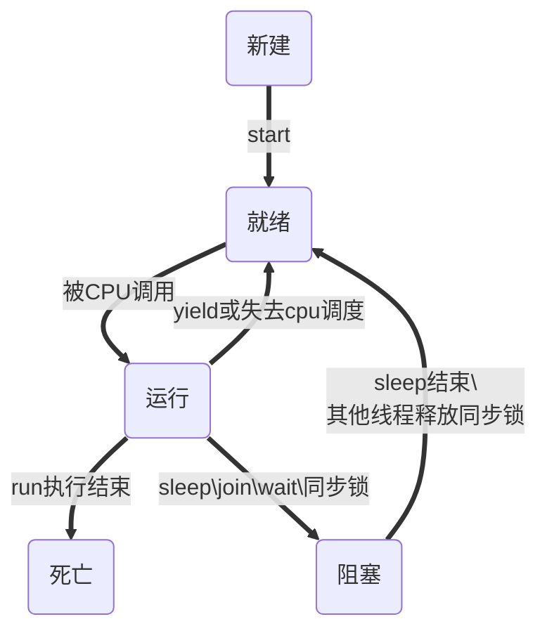

# 第10章 多线程

## 10.1 程序、进程、线程

- **程序：**是为了完成某一个特定的任务而编写的指令集合，静态的；
- **进程：**是程序一次执行状态，或者正在运行的程序，动态的；
- **线程：**是进程中的执行流程，一个进程中可以同时包括多个线程；


## 10.2 多线程的实现方式

### 10.2.1 两种实现方式

> **多线程并 不能 提高执行效率**

#### 多线程优势：

- 提高程序响应，优化用户体验
- 提高CPU利用率
- 改善了程序的结构


#### 继承Thread类

```java
class MyThread extends Thread{
	@Override
	public void run(){
		for (int i = 0; i < 50; i++) {
			System.out.println(Thread.currentThread().getName()+"==="+i);
		}
	}
}

public static void main(String[] args) {
    MyThread myThread = new MyThread();
    myThread.setName("Thread1");
    //satrt()方法 导致此线程开始执行; Java虚拟机调用此线程的run方法
    myThread.start();
    MyThread myThread2 = new MyThread();
    myThread2.setName("Thread2");
    myThread2.start();
}
```

#### 实现Runnable接口

```java

class Window2 implements Runnable {
	Object object = new Object();
	int ticket = 100;

	@Override
	public void run() {
        //线程
		synchronized (object) {
			while (true) {
				if (ticket > 0) {
					System.out.println(Thread.currentThread().getName() 
                                       + "  售票:  " + ticket--);
				} else {
					break;
				}
			}
		}
	}
}

```


### 10.2.2 线程中常用方法

| 方法名                | 作用                                                 |
| --------------------- | ---------------------------------------------------- |
| start()               | 此线程开始执行；java虚拟机调用此线程的run方法；      |
| run()                 | 多线程启动后执行的内容                               |
| currentThread()       | 返回当前的线程对象引用                               |
| getName()             | 获取当前线程对象的名称                               |
| setName(String name)  | 给当前线程赋名                                       |
| yield()               | 当前线程释放CPU执行权（大公无私）                    |
| join()                | 在A线程中调了B线程join()，A线程停止执行，知道B执行完 |
| setDaemon(boolean on) | 在启动前(start())设置当前线程为守护线程              |
| isAlive()             | 判断线程是否存活                                     |
| wait()                | 使当前线程处等待状态                                 |
| notify()、notifyAll() | 唤醒wait()一个或多个线程                             |
| sleep(long time)      | 使线程休眠time毫秒                                   |

### 10.2.3 线程的优先级

```java
setPriority(int newPrority)
//更改此线程的优先级 min - max   1 - 10
    
public final int getPriority()
//返回这个线程的优先级
```


### 10.2.4 线程分类

- 守护线程：jvm垃圾回收，jvm中如果都是守护线程，JVM退出；
- 用户线程：


## 10.3 线程的生命周期




## 10.4 线程的同步

- **同步块**

  ```java
  Synchronized(监视器){//锁
      //多个线程共享的资源
  }     
  //监视器：可以是任意共享对象(多个线程共用的一个对象)
  //资源：操作
  ```

  > 有关继承Thread类和实现Runnable接口，实现接口会更好：
  >
  > 1、创建共有的对象接口只有一个，同步锁的对象可以是this
  >
  > 2、类是单继承的，不能在继承其他类；

- **同步方法**

  ```java
  //语法：权限修饰符 synchronized 返回值 方法名(){
  	//建议，锁小不锁大
      @Override
        public void run(){
            同步方法();
        }
  }
  
  ```


## 10.5 线程通信

- **wait()**：当前线程挂起，处于等待状态，并释放CPU资源（释放锁）区别于sleep()不释放锁；
- **notify()**：唤醒正在排队等待(wait())的某一个线程；

- **notifyAll()**：唤醒正在排队等待(wait())的所有线程

**必须在同步块or同步方法中使用；**


## 10.6 补充

### 死锁

  ```java
public class DeadThreadTest {
   static Object obj1 = new Object();
   static Object obj2 = new Object();
   public static void main(String[] args) {

      new Thread(){
         @Override
         public void run(){
            synchronized (obj1){
               System.out.println("线程一obj1");
               try {
                  Thread.sleep(500);
               } catch (InterruptedException e) {
                  e.printStackTrace();
               }
               synchronized (obj2){
                  System.out.println("线程一obj2");

               }
            }
         }
      }.start();

      new Thread(){
         @Override
         public void run(){
            synchronized (obj2){
               System.out.println("线程二obj2");
               synchronized (obj1){
                  System.out.println("线程二obj1");

               }
            }
         }
      }.start();
   }
}

//尽量减少同步块or同步方法的嵌套
  ```


### 懒汉式单例

```java
class Singleton{
    //1 创建构造器
    private Singleton(){}
    //2 创建对象
    private statle Singleton singleton = null;
    // 3判断，返回对象
    public static Singleton getInstence(){
        synchronized (Singleton.class){
            
            if(singleton == null){
                singleton = new Singleton();
            }
        }
        return singleton;
    }
}

//非静态方法锁对象可以用this，注意继承方式实现线程要用静态对象
//静态方法锁对象是该类的类型（类名.class）

//Objcet.lock()
//Objcet.unlock()
//手动释放锁
```

