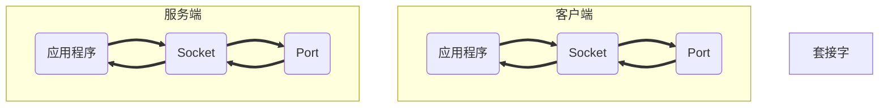

# 第13章 网络编程

## 1. 概述

- **计算机网络**：把分布在不同区域的计算机与专门外设用通信线路练成一个整体，实现两者的相互通信；
- **网络编程目的**：通过网络协议实现通信；

- **如何通信**
  1. 通信双方IP、通信端口
  2. 双方通信协议（基于传输层TCP/UTP）


## 2. 通讯要素

- ip地址和通讯
- 


## 3. 网络通信协议

| TCP传输控制协议                  | UDP用户数据报协议          |
| -------------------------------- | -------------------------- |
| 必须建立连接                     | 不必须建立                 |
| 三次握手，可靠                   | 不可靠                     |
| 位于两个进程（客户端-服务）      | 传输的是数据包             |
| 可以传输大量数据                 | 数据包大小为64k            |
| 传完需要释放已建立的连接，效率低 | 传输完无需释放资源，效率高 |

- 传递的socket套节字
  - socket套节字也可以做是通讯时传输的一个字节流，一般主动发起通信应用程序叫做客户端
- **端口号：**0~665525（$2^{16}-1$）




## 4. TCP

```java
//实例：TCP客户端和服务端传递信息
public class InterHomeTest {
	@Test
	public void client() throws IOException {
		//客户端
		//创建socket对象
		Socket socket = new Socket(InetAddress.getByName("127.0.0.1"), 8888);
		//create outputstream
		OutputStream os = socket.getOutputStream();
		//send data to service
		os.write("Hello,world".getBytes());
		socket.shutdownOutput();
		//读取服务器返回的信息
		InputStream is = socket.getInputStream();
		BufferedReader br = new BufferedReader(new InputStreamReader(is));
		System.out.println("服务器回传信息：");
		String message = br.readLine();
		System.out.println(message);
	}

	//服务端
	@Test
	public void server() throws IOException {
		try {
			ServerSocket serverSocket = new ServerSocket(8888);
			System.out.println("服务器套接字已创建成功");
			while (true) {
				System.out.println("等待客户机的连接");
				System.out.println();
				//获取客户端传递数据
				Socket socket = serverSocket.accept();
				System.out.println("接受成功");
				//实例化BufferedReader对象
				BufferedReader reader = new BufferedReader(new InputStreamReader((socket.getInputStream())));
				//读取信息
				String line;
				System.out.println();
				System.out.println("receive message:");
				line = reader.readLine();
				System.out.println(line);

				//回传信息给客户端
				BufferedWriter bw = new BufferedWriter(new OutputStreamWriter(socket.getOutputStream()));
				String message = line;
				bw.write(message.toUpperCase() + "\n");
				bw.flush();
				bw.close();
				break;
			}
		} catch (IOException e) {
			e.printStackTrace();
		}
	}
}
```


```java
/**
 * @fileName: TCPTest2
 * @author: orange
 * @date: 2019/6/14 15:35
 * @description: 客户端传递本地图片到客户端，客户端回复收到
 * @version: 1.0
 */

package day018;

import org.junit.Test;

import java.io.*;
import java.net.InetAddress;
import java.net.ServerSocket;
import java.net.Socket;

public class TCPTest2 {
   @Test
   public void client(){
      try {
         Socket socket = new Socket(InetAddress.getByName("127.0.0.1"),2019);
         OutputStream outputStream = socket.getOutputStream();

         //读取本地图片
         FileInputStream fis = new FileInputStream(new File("src\\img.png"));
         byte[] bytes = new byte[1024];
         int len;
         //输出到服务端
         while((len = fis.read(bytes))!=-1){
            outputStream.write(bytes,0,len);
            outputStream.flush();
         }
         socket.shutdownOutput();
         //读取服务器返回信息
         InputStream inputStream = socket.getInputStream();
         BufferedReader br = new BufferedReader(new InputStreamReader(inputStream));
         String line = br.readLine();
         System.out.println(line);

      } catch (IOException e) {
         e.printStackTrace();
      }
   }
   
   @Test
   public void serve(){
      try {
         ServerSocket ss = new ServerSocket(2019);
         System.out.println("服务端已建立，等待客户端~~");
         Socket socket = ss.accept();

         //读取客户端信息,保存在服务端
         InputStream inputStream = socket.getInputStream();
         FileOutputStream fos = new FileOutputStream(new File("src\\newImg2.png"));
         byte[] bytes = new byte[1024];
         int len;
         //输入到服务端
         while((len = inputStream.read(bytes))!=-1){
            fos.write(bytes,0,len);
            fos.flush();
         }
         OutputStream outputStream = socket.getOutputStream();
         outputStream.write("Copy successful".getBytes());
         outputStream.flush();
         outputStream.close();
         fos.close();

      } catch (IOException e) {
         e.printStackTrace();
      }
   }
}
```


## 5. UDP

- DatagramPakcet：表示数据包；

- DatagramSocket：表示发送和接受数据包的套接字；

```java
/**
 * @fileName: UDPTest
 * @author: orange
 * @date: 2019/6/14 16:16
 * @description: UDP实现的发送和接受测试
 * @version: 1.0
 */

package day018;

import org.junit.Test;

import java.io.IOException;
import java.net.*;

public class UDPTest {
   @Test
   public void send(){
      try {
         DatagramSocket ds = new DatagramSocket();
         byte [] bytes = "Hello world".getBytes();
         DatagramPacket dp = new DatagramPacket(bytes,bytes.length, InetAddress.getByName("127.0.0.1"),2019);
         ds.send(dp);
         ds.close();
      } catch (Exception e) {
         e.printStackTrace();
      }
   }

   @Test
   public void receive() throws IOException {
      DatagramSocket ds = new DatagramSocket(2019);
      byte [] bytes = new byte[1024];
      DatagramPacket dp = new DatagramPacket(bytes,0, bytes.length);
      ds.receive(dp);
      String s = new String (dp.getData(),0,dp.getLength());
      System.out.println(s);
   }
}
```


## 6. URL编程

- **<u>URL</u>**：（uniform resource locator 统一资源定位器）

- **组成**：<传输协议>://<主机名>:<端口号 默认 80>/<文件名>

```java
public class URLTest {
   @Test
   public void test1() throws MalformedURLException {
      URL url = new URL("http://127.0.0.1:8080/img/1.gif");
      System.out.println(url.getProtocol());
      System.out.println(url.getHost());
      System.out.println(url.getPort());
      System.out.println(url.getPath());
      System.out.println(url.getFile());
   }
}
```

