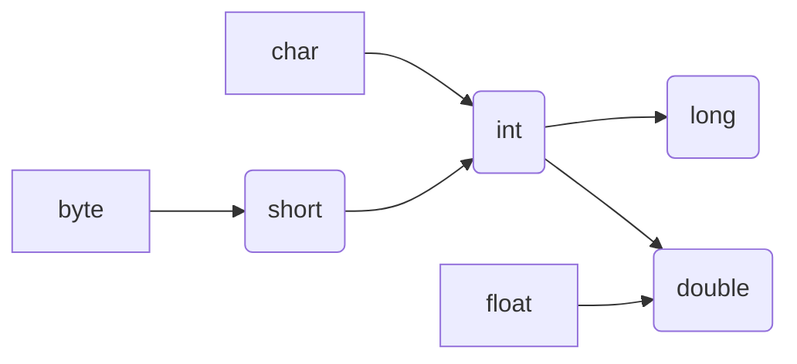

<!--

 * @Author: Orange
 * @Date: 2019-05-22 09:07:08
    -->

# 数据类型和运算符

## 0. Eclipse 工具的使用

1. new->project->java project
2. Working sets:工作空间设置
3. 设置代码注释默认值

## 1.1 变量

定义：内存在存储数据区域
使用变量语法：

```java
    数据类型 变量名称=变量值
    int num = 1;
    String name = "shine";
```

## 1.2 数据类型

### 基本数据类型(8 种)

- byte(1)
- short(2)
- int(4)
- long(8)
- float(4)
- double(8)
- char(2)//一个字母 1 个字节，一个汉字 **2 个字节**
- boolean(1)



### 自动数据类型转换

- 小容量->大容量，不超过表示范围
- byte,char,short->int->long->float->double

```java
    byte b1=10;
    int i1=b1;
    char c1='a';
    int i2='a'; //a=>97 b=>98…… A=>65 B=>66……
```

### 强制类型转换

丢失精度

> 面试(编码)细节：使用浮点数，能够使用 float 就尽量使用 float，可以提高执行效率，占用内存更小


### 关于类型的自动提升，java定义若干适用于表达式的类型提升规则：

> 第一，所有的**byte型、short型和char型**的值将被提升到int型；
> 第二，如果一个操作数是long型，计算结果就是long型；
> 第三，如果一个操作数是float型，计算结果就是float型；
> 第四，如果一个操作数是double型，计算结果就是double型。


### 装箱与拆箱

> 装箱：基本类型转换成对应的包装类；
>
> 拆箱：包装类转换成对应的基本类型；

```java
//装箱
int a = 10;
//1、通过new
Integer b = new Integer (a);
//2、通过静态valueof
Integer b = Integer.valueOf(a);

//拆箱
int d = b.intValue();
```

> 从JDK1.5版本之后，编译器会自动完成拆箱和装箱过程；

```Java
Integer a = 5;
```


## 1.3 运算符

### 算术运算符

- i++ 及 ++i 区别：一个先加后运算，一个先参与运算后加值
- eg
```java
	int i =3;
	int j= i++ + ++i + i++;
	System.out.println(j);//13
```

### 赋值运算符

```java
	int i=10;
	byte b=8;
	//b=(byte)(i+8)  需要强制转换
	b+=i; //不需要强制转换
```
### 比较运算符（关系运算符）


### 逻辑运算符

| 运算符   | 符号 | 说明                                        |
| :------- | :--: | ------------------------------------------- |
| 逻辑与   |  &   | 两个操作数为true，结果才是true，否则是false |
| 逻辑或   |  \|  | 两个操作数有一个是true，结果就是true        |
| 短路与   |  &&  | 只要有一个为false，则直接返回false          |
| 短路或   | \|\| | 只要有一个为true， 则直接返回true           |
| 逻辑非   |  ！  | 取反：!false为true，!true为false            |
| 逻辑异或 |  ^   | 相同为false，不同为ture                     |

### 位运算符

| 位运算符 | 说明                                                 |
| -------- | ---------------------------------------------------- |
| ~        | 取反                                                 |
| &        | 按位与                                               |
| \|       | 按位或                                               |
| ^        | 按位异或                                             |
| <<       | （带符号-不改变符号）左移运算符，左移1位相当于*2     |
| >>       | （带符号-不改变符号）右移运算符，右移1位相当于÷2取商 |
| >>>      | （不带符号）右移运算符，                             |

### 三元运算符

```java
语法： 条件表达式？值1：值2
规则： 如果条件表达式值为真，则返回值1，否则返回值2；
```

### 运算的优先级


------


## 1.4 常用引用类型

### 接受键盘输入类（Scanner）

定义：一个简单问题描述器类

使用：

```java
Scanner sc = new Scanner(System.in);
String str = sc.next();//接收用户输入字符串类型的数据
int num = sc.nextInt();//接收用书输入整型的类型
```


### 随机数类（Random/Math）

- Random类

  ```java
  Random rand = new Random();
  int n = rand.nextInt(5);//生成0-4任意一个整数，[0,5）
  double x = rand.nextDouble(4);
  ```


- Math类

  定义：Math类包含执行基本数字运算的方法（静态）;

  使用：

  ```java
  Math.random(double a);//返回double类型的值，范围为[0,1)
  ```

  