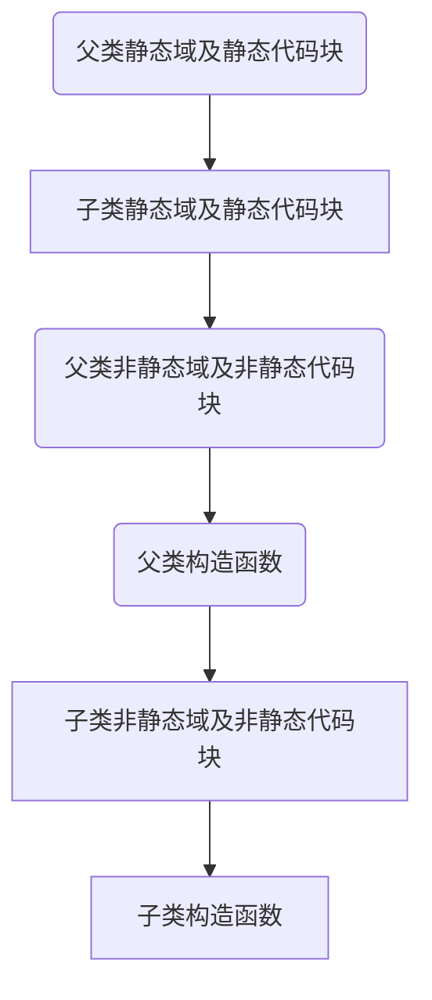

# 第六章 面向对象高级

## 6.1 面向对象特征（3）

### 封装

问题：当用户创建对象时，输入数据不准确/规范；

解决：定义方法给属性赋值，将属性设权限修饰符，这种实现方式就是**封装**；

1. 将属性私有化；
2. 提供公共方法（get\set）来设置or获取私有属性；

### 继承

- 目的：实现代码的复用
- 语法：**class  subclass extends superclass**  
- 特点：
  1. 子类继承父类，子类会继承父类中的**所有**成员（权限范围内）；
  2. 子类**不能继承**父类中的构造器，只能用super调用；
  3. 单继承，**子类只能有一个直接父类**，一个父类可以有多个子类；
  4. 继承具有传递性，若没有直接父类，则默认继承java. Lang下的object类；
  5. extends，扩展，子类不是父类的子集，是父类的扩展；

### 多态

定义：同一事物的不同表现形态；两个或两个以上的对象在调用父类中的方法时，实现了各自的方法；

```Java
语法： 父类 对象 = new 子类();
      父类调用指向子类引用；
```

​       ~~子类 对象 = new 父类()~~

- 对于多态来说，编译状态（看左边类型）- 运行状态（看右边类型）

- 实现：向上转型--父类 对象 = new 子类() ——自动类型转换

  ​			向下转型--父类类型对象 instanceof 子类类型 => 子类类型 对象 = (子类类型) 父类类型对象；

- 类的**属性没有多态性**（属性不能被子类的属性覆盖）


## 6.2 javaBean和关键字(package\import)

### javaBean标准：

1. 该类是公共的(public)
2. 有私有属性并提供getter/setter方法

### package

1. 定义包，以目录方式管理JavaBean；package 包名
2. 写在类的首行；目录结以  **.**  分隔，以  “  ；” 结束
3. 定义包的规范：项目类型.公司名称.项目名称.模块名称；包名所有名称小写

### import

1. 导入相关类 import   包名.类名/接口名；
2. 可以使用*通配符；
3. 如果要调用不同包中的相同类名，调用第二个类时直接通过 com.aura.java.Test1 test = new com.aura.java.Test1()；定义全路径
4. 在java.lang包下接口或类自动导入，不需要import；eg：String、Math、System等；
5. 静态导入， import static 包名.类名.静态成员；


### 给属性赋值的先后顺序

1. 通过创建对象给属性赋初始值；
2. 显示给属性赋初始值；
3. 通过构造器给属性赋值；
4. 通过setter赋值；


## 6.3 方法重写

定义：对父类方法覆盖（重写）

### 增强重写父类中的方法

1. 子类方法和父类方法的返回值类型、方法名称、参数列必须一致；

   **注意**：父类方法：public 父类类型 方法名(参数) {}

   ​            子类方法：public 父类类型 方法名(参数) {}

2. 子类方法的权限修饰符不能小于父类的权限修饰符

3. 子类方法抛出异常不能大于父类方法抛出的异常

4. 字父类方法同为static or 非static;

   ------

5. final修饰的方法不能被重写；
6. abstract 抽象类方法，必须被子类方法重写；
7. native  没有方法，调用C 或 C++的实现
8. synchronized 线程锁，和重写无关；


## 6.4 super 关键字

> 可以显示调用父类的属性、方法、构造器；
>
> super.属性；
>
> super.方法()；
>
> super.构造器(参数)；

##### 显示调用

##### 隐式调用

#### super调用构造器规则

```
1. 默认子类构造器会隐式调用父类的无参构造器；
```

2. super()只能出现在构造器首行；
3. super()和this()不能同时出现；
4. super(参数)表示显示调用父类相应参数的有参构造器；


## 6.5 object类

- object类是所有类的父类；

- equals(); 默认判断对象的地址是否相等；如果某一个重新object类的equals方法，则实现重写后的规则；

- “==”  可以比较基本类型：**值比较**；比较引用类型：**地址比较**

- toString()方法，重写：

  ```java
  @Override
  public String toString() {
  	return "ComPerson{" + "name='" + name + '\'' + ", ID=" + ID + ", salary=" + salary + '}';
  }
  ```


## 6.6 String类

效率：StringBuilder > StringBuffer > String

String 类代表字符串，它们的值在创建后不能被更改，StringBuffer支持可变字符串。

```java
String s1 = "abc";
String s2 = "abc";

//编译时确定
String s3 = "ab" + "c";

//运行时确定
String s4 = "ab" + new String("c");
String s5 = "ab";
String s6 = "c";
String s7 = s5 + s6;
String s8 = (s5+s6).intern();//手动入池

System.out.println("s1==s2:"+(s1==s2));//true
System.out.println("s3==s1:"+(s3==s1));//true
System.out.println("s1==s4:"+(s1==s4));//false
System.out.println("s1==s7:"+(s1==s7));//false
System.out.println("s1==s8:"+(s1==s8));//true
```


## 6.7 junit 单元测试


## 6.8 包装器类

- 类里有相应方法方便用于调用
- 可以用类的对象和null进行比较，避免java.lang.nullPointException(空指针异常)
- 拆箱
- 装箱


## 6.9 statci关键字

static：表示静态，可以修饰属性、方法、代码块、内部类；

- 修饰属性（类变量）：

  > 属性可以**被多个对象所共享**的，不会随着属性的不同而改变；

  - 属于类的，调用方式：类名.属性
  - 属于所有对象的公共属性，对象.属性
  - 类变量随着类的加载而加载；且独一份；
  - 早于对象的创建；
  - 类变量存储在静态域中；
  - 生命周期比成员变量长；

- 修饰方法：
  
  > 操作静态属性的方法，通常设置为static
  >
  > 工具类中的方法，通常设置为static；例如Math、Arrays……
  
  - 类加载进行加载static修饰方法
  - 调用  类名.方法()  对象.方法()
  - static修饰的方法叫静态方法，只能调用静态成员，不能调用非静态成员；
  - 在static修饰方法里面不能出现this或者super关键字；
  - **static修饰的方法属于类，非staitc方法属于对象**，在static方法中调用非static方法需要通过对象进行调用；
  
- static final 全局常量属性；


## 6.10 设计模式（单例）

设计模式：在大量的实践中总结和理论化之后的优选代码结构，编程风格以及解决问题的思维方式

单例设计模式：采用一定的方法保证在**整个软件系统中只创建一个对象**；

分类：

1. 饿汉式（线程安全）：

```java
class Singleton{
    //1.将构造器私有化
    private Singleton(){}
    
    //2.定义创建一个私有对象
    private static Singleton instence = new Singleton();
    
    //3.创建get方法
    public static Singleton getInstence(){
        return instence;
    }
}
```

2. 懒汉式（非线程安全）

```java
class Singleton{
    //1.将构造器私有化
    private Singleton(){}
    //2.定义创建一个私有对象
    private static Singleton instence;
    //定义公共静态方法
    public static Singleton getInstence(){
        if(instence == null){
            return new Singleton();
        }
        return instence;
    }
}
```


## 6.11 final

final可以修饰属性、方法、类

- 修饰类：final class  类名 表示该类是一个最终类，不能被其他类继承；
- 修饰方法：final 返回值类型 方法名() 表示该方法不能被重写；

- 修饰属性：表示该属性是一个常量，该常量**一般用大写字母**表示；

- 常量值一旦赋值，不能被修改；

  ### 给常量初始化：

  1. 显示初始化赋值 **final 类型 常量名 = 值**；
  2. 通过代码块进行初始化；
  3. 静态代码块赋值
  4. 构造器进行初始化

  ```java
  public class TestFinal{
      //显示初始化赋值
      final String CITY = "BeiJing";
      static{
          CITY = "Guangzhou";
      }
      //构造块赋值
      {
      	CITY = "Shanghai";
      }
      //构造器赋值
      public TestFinal(){
          CITY = "ShenZhen";
      }
      
  }
  ```

  

## 6.12 main


## 6.13 代码块

- 普通代码块（局部代码块）

  方法的{}  if{}  在方法里面的

- 构造代码块（实例代码块）

  写在类中，在构造器前执行，创建一次对象就调用一次

- 静态代码块

  static{} 在类加载的时候执行，只执行一次；会在构造块前执行；

- 同步代码块

  

  #### 代码运行顺序




## 6.14 抽象类、抽象方法

- **抽象类**：用抽象abstract关键字修饰的类

#### 抽象特点

1. 抽象类不能被实例化（不能直接创建对象），用来被继承的；

2. 抽象类中可以有构造器；
3. 抽象类中可以有抽象方法也可以有非抽象方法；
4. 抽象方法不能具体实现（没有方法体）
5. 有抽象方法的类一定是抽象类；
6. 抽象方法必须被继承的子类重写实现；
7. final 和 abstract 不能同时修饰一个类

