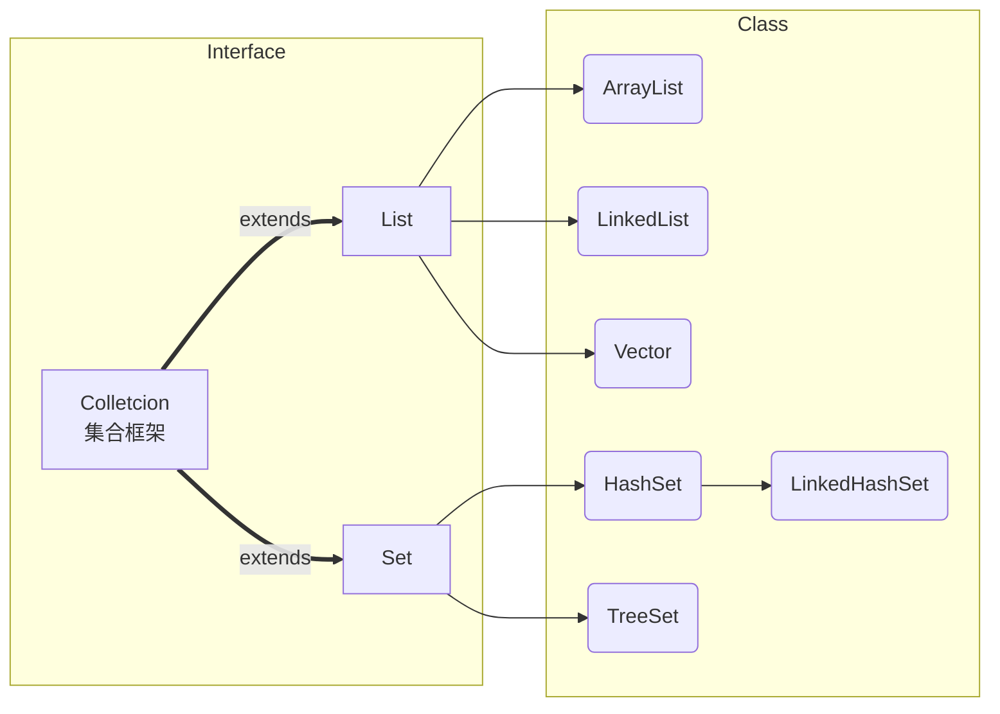

# 第8章 高级特性

## 8.1 异常处理

###  Error 错误

Java虚拟机的错误，程序无法解决；


### Exception 异常

编程出现的错误，可以解决；


### 8.1.2 java异常结构

```java
java.lang.Objcet
	java.lang.Throwable
		java.lang.Error            //java虚拟机的错误
		java.lang.Exception        //编译时出现的错误
			//编译异常 javac.exe
			//运行异常 java.exe
```


### 8.1.3 处理异常

#### 方式1：捕获

```java
//方式1
try{
    //可能会有异常的代码
    //or编译时出现错误的代码
    //作用域（局部变量）                                            
}
catch(抓取或捕获异常对象的类型 e){
    //捕获错误信息
    //捕获错误信息方式：
    e.getMessage();
    e.printStackTrace();
    //输出自定义错误信息
    
}
finally{
    //无论什么情况都会执行
}

//方式2 抛出异常
throw new Exception("错误自定义的消息")
```

注意：

1. 多个catch块：如果异常类型是子父类的关系，子类异常在前，父类异常在后；

2. 写多个catch目的：更详细捕获不同的错误

3. finally 无论如何都会执行，哪怕前面有return

4. 如果有异常，同块中的异常后面的代码是不执行的；

   

#### 方式2：抛出

> 一个方法中可能会发生多种异常，但是不能确定，可以用抛出方式，将异常抛给调用者；

```java
//声明 在方法名的后面 throw 异常类型1，异常类型2，
public class ErrorTest {
	public static void main(String[] args) {
		show();
		System.out.println("hello");
	}
	public static void show() throws IOException {
		FileInputStream file = new FileInputStream(new File(""));
		System.out.println(file.read());
		System.out.println("Hello");
	}
}
```

#### 方式3：自动抛出

```java
int i = 10 / 0;
```

#### 方式4：手动抛出

```java

```


## 8.2 集合

### 8.2.1 Java集合框架

- **集合：**

java集合就像一种容器，可以**动态**地把**多个对象**的引用放入容器中；

两大集合：Collection Map



#### Collection 接口

> Collection是单列集合的顶层接口，声明了所有单列集合的共性功能；

- boolean add(E e) ：添加元素
- Collection Arrays.list(object) : 将元素转为list
- void clear() : 清除集合中的所有元素；
- boolean remove(Object o)； 删除集合中的object元素  
- boolean contains (Object o);  判断集合中是否包含该元素；
- int hashcode() ；返回哈希码
- boolean isEmpty() ； 判断集合中的元素是否为空
- int size()； 获取集合元素个数
- Object[] toArrya()； 集合转数组
- Arrays.asList(T....t)  数组转集合

##### Set接口：

> 元素无序，唯一（不可重复）个数据
>
> 无序：指元素底层存储的位置是无序的（hashcode）
>
> 唯一：是指相同元素，后位不能添加

- Hashset

  > 保证唯一性，一定要重写equals()和hashcode()两个方法；
  >
  > 理解：元素如何保证唯一，使用hashcode算法得到对象的地址，如果没有，则将元素放入该位置；如果有，调用equals方法判断元素内容是否相等==>若属性相同，则不增加，若不同，则覆盖原有元素；

- LinkedHashSet（链表方式存储）

  > 输出的顺序和添加的顺序有关（前项索引指向后项索引）；
  >
  > 与HashSet区别：遍历时效率更高，插入和删除效率较低；

- TreeSet

  > 1. TreeSet添加元素类型必须一致；
  > 2. 输出的顺序可以按照一定规则


##### List接口：

> 存放有序，不唯一（可以重复）的数据；

- ArrayList

  | 方法                                           | 作用                                  |
  | ---------------------------------------------- | ------------------------------------- |
  | void add(int index , E e);                     | 在指定下标处添加元素                  |
  | E get(int index)                               | 在指定下标处添加元素                  |
  | E remove(int index);                           | 根据下标进行删除，E代表返回删除的对象 |
  | boolean add(E e)；                             | 添加单个元素                          |
  | List<E> subList(int fromaindex , int endIndex) | 返回列表中[index,index)之间的元素     |

- LinkedList（以链表方式存储，按顺序【非连续】）

  | 方法               | 作用                       |
  | ------------------ | -------------------------- |
  | void addFirst(E e) | 将指定元素添加在第一个位置 |
  | void addLast(E e)  | 将指定元素添加在末尾       |
  | E getFirst()       | 获取第一个位置的元素       |
  | E getLast()        | 获取最后一个元素           |

- ArrayList - LinkedList区别

  - ArrayList遍历效率高，插入和删除较低；
  - LinkedList遍历效率略微比ArrayList低，插入和删除效率高；
  - 排序方式：
    - 1、自然排序：实现Compareable接口
    - 2、定制排序：实现Compar


##### Map接口：

> 健<=>值 对方式
>
> map接口和Collection接口是并列；

- HashMap


  - - **添加、删除操作：**

    ```java
    - Object put(Object k,Object v);//添加元素
    - Object remove(Objcet key);    //删除元素
    - 
    ```

  - - **map 集合操作**

      ```java
      Set keySet();           //健的集合
      Collection values();    //值的集合
      Set map.entrySet();     //键值集合
    ```

- **LinkedHashMap**
  - 存储数据和输出顺序一致；
  - 以链表方式存放；

- **TreeMap**
  - 按照添加的KEY属性顺序进行排序；
  
  - 自然排序：实现的接口 Comparable    - int compareTo(Object o)

    ```java
    //自然排
    //1> 创建需要排序的类 实现 Comparable <需要排序的类型>
    //2> 重写 compareTo 返回值如果返回0 证明两个对象相同,则不能存入集合
    
    @Test
    	public void test2() {
    		TreeMap treeMap = new TreeMap();
    		treeMap.put(new Person2("Jack"),88);
    		treeMap.put(new Person2("Mack"),33);
    		treeMap.put(new Person2("Nack"),22);
    		treeMap.put(new Person2("Hack"),53);
    		treeMap.put(new Person2("Kack"),23);
    		System.out.println(treeMap);
    	}
    
    //需要排序的类，实现Comparable
    class Person2 implements Comparable {
    	private String name;
    
    	public String getName() {
    		return name;
    	}
    
    	public void setName(String name) {
    		this.name = name;
    	}
    
    	public Person2(String name) {
    		this.name = name;
    	}
    
    	@Override
    	public boolean equals(Object o) {
    		if (this == o)
    			return true;
    		if (!(o instanceof Person2))
    			return false;
    		Person2 person2 = (Person2) o;
    		return getName().equals(person2.getName());
    	}
    
    	@Override
    	public int hashCode() {
    		return Objects.hash(getName());
    	}
    
        //重写compareTo()方法
    	@Override
    	public int compareTo(Object o) {
    		if (o instanceof Person2){
    			Person2 p2 = (Person2)o;
    			return this.name.compareTo(p2.name);
    		}
    		return 0;
    	}
    	@Override
    	public String toString() {
    		return "Person2{" + "name='" + name + '\'' + '}';
    	}
    }
    ```
  
    
  
  - 定制排序：实现的接口 Comparator    - int compare(Object o1,Object o2)
  
- **HashTable:**

  - 基于线程安全；

  - 与HashMap区别：

    - 不能保证数据顺序；
    - 如果Key值一样，会进行数据替换；

  - **Properties：读取、操作属性文件**

    ```java
    
    ```

    


### 8.2.2 iter迭代器（遍历集合中的元素）

> **Iterator**： 获取集合对象遍历的迭代器；主要用于获取（遍历）集合中的元素；

```java
Collection coll = new ArrayList();
//1、for循环
for (int i = 0; i < coll.size(); i++) {
    System.out.println(((List)coll).get(i));
}

//2、增强for循环
for (Object o : coll) {
    System.out.println(o);
}

//3、迭代器
Iterator it  = coll.iterator();
while(it.hasNext()){
    Object obj = it.next();
    System.out.println(obj);
}
```


## 8.3 泛型

### 定义

- 解决集合中的两个问题

  - 解决元素存储的安全问题（添加元素时要检查元素类型）；
  - 解决元素类型转换问题；

  ```java
  List<Integer> list = new ArrayList<Integer>();
  ```

- 泛型，起到对类型限定的作用；

### 使用

- 泛型类
- 泛型接口

```java
//泛型类
class Dao<T> {
	public void add(T t) {
	}
	public List<T> search(T t) {
		return null;
	}
	public void del(T t) {
	}
	public boolean update(T t) {
		return true;
	}
}
```

```java
public class Generic2Test {
	@Test
	public void test(){
		List<Book2> list = new ArrayList<>();
		Book2 book1 = new Book2("三国",32.5);
		Book2 book2 = new Book2("西游",30.3);
		Book2 book3 = new Book2("水浒",42.5);
		list.add(book1);
		list.add(book2);
		list.add(book3);
		Iterator<Book2> it = list.iterator();
		while(it.hasNext()){
			Book2 next = it.next();
			System.out.println(next);
		}
	}
}

class Book2{
	String name;
	Double price;

	public Book2(String name, Double price) {
		this.name = name;
		this.price = price;
	}
	@Override
	public String toString() {
		return "Book2{" + "name='" + name + '\'' + ", price=" + price + '}';
	}
}
```

- 泛型方法

  > 调用方法时来决定参数或返回值的类型；

  ```java
  //以下均为泛型方法
  public <E> E[] show(E[] e){
  	return e;
  }
  
  public <E> void show1(E e){
  	return e;
  }
  
  public <E,S> void show2(E e,S s){
      return e;
  }
  ```

  

### 继承关系\通配符

- List\<?\>是所有List<>类型的父类；
- List\<A>和List\<B>之间是平行关系；
- List\<?>可以遍历，但不能修改；
- <? extends E>

```java
public void test3(){
    Object o = new Object();
    String str1 = "str";
    o = str1;
    System.out.println(o);

    Object[] o2 = new Object[2];
    String[] strings = {"aa", "cc"};
    o2 = strings;
    System.out.println(o2[0]+"==="+o2[1]);

    List<Object> obj2 = new ArrayList<>();
    List<String> str2 = new ArrayList<String>();
    str2.add("Hello");
    obj2 = str2;//报错
    //在集合和泛型中这不是继承，是平行关系
    //如果S是Ｆ的子类.那么List<S>不是List<F>的子类
    
    List<?> list = null;
    list = obj2;
    list = str2;
    // ？ 是一个通配符
    // 所有List<>都是List<?> 的子类型；
    // List<?> 只能添加null，其他无法修改添加，但是可以遍历；
	}
```


@time: 20190610

## 8.4 枚举（有限个对象）

### 8.4.1 自定义枚举


```java
class People{
	//1.属性私有
	private String name;
	private int age;

	//2.构造器私有化
	private People(String name, int age) {
		this.name = name;
		this.age = age;
	}
	//3.创建对象
	public final static People MAN= new People("Jack",24);
	public final static People WOMAN= new People("Rose",20);
    //通过类名.对象进行调用
    //People man = People.MAN;
}
```


### 8.4.2 通过关键字enum定义枚举

```java
enum People2{
	/**
	 * 枚举例子
	 * 创建对象必须在最前
	 * 调用  People2.MAN.info();
	 */
	MAN("小明",20),
	WOMAN("小花",24);

	private final String name;
	private final int age;

	People2(String name, int age) {
		this.name = name;
		this.age = age;
	}

	public String info(){
		return new StringJoiner(", ", People.class.getSimpleName() + "[", "]").add("name='" + name + "'").add("age=" + age).toString();
	}
}
```


### 8.4.3 如何实现接口

```java
enum People2{
	MAN("小明",20),
	WOMAN("小花",24);

	private final String name;
	private final int age;

	People2(String name, int age) {
		this.name = name;
		this.age = age;
	}

}

interface Interface01{
    void show();
}

//两个常用方法
//1、values()
//获取枚举类中所有对象
//通过foreach循环白遍历
//2、valueOf(String)
//获取其中一个
System.out.println(People2.valueOf("MAN"));
```


## 8.5 注解

- **注解**：代码的一个特殊标记，可以在编译类，加载、运行时读取。程序可以在不改变原有代码的基础上，在文件内嵌入补充信息；

- **可以修饰**：包、类、方法、构造器、参数、局部变量

### 8.5.1 jdk基本注解（3个）

1. ***@Override***                     **限定重写**方法
2. ***@Deprecated***                标注该元素**已过时**
3. ***@SuppressWarnings***    消除警告


### 8.5.2 自定义注解

- **语法**：public @interface 自定义注解名称{ }

  

### 8.5.3 元注解

- 对注解进行注解
- **元数据**：
- @Target
- @Retention
- @Documented  生成javaDoc文档

```java
@Target({TYPE, FIELD, METHOD, PARAMETER, CONSTRUCTOR, LOCAL_VARIABLE})
@Retention(RetentionPolicy.RUNTIME)
public @interface MyAnnotation {
	String value() default "abc";
}
```


