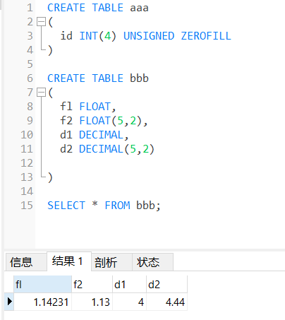
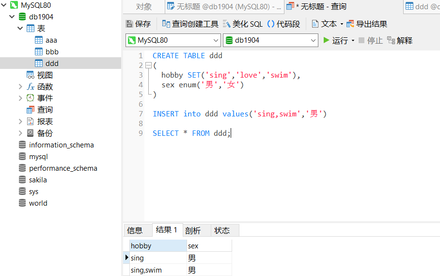

# MySQL数据库

@Time 20190618

## 1. 数据与数据库

- **数据**：客户存在记录信息并且鉴别的符号

- **数据存储方式：**纸张、磁盘、光盘等；

- **数据存储目的：**<u>**检索**</u>

- **数据库（DB:Data Base）：**按照某种数据结构，存储数据的一个仓库；

- **数据库分类：**

  - 关系型数据库：存储以一张二维表结构方式来进行存储；
  - 非关系型数据库：不是以二维表方式；

- **数据库管理系统（DBMS:Data Base Management System）:**

  - 用于操作和管理数据库的软件系统（RDBMS）；
  - 关系型数据库管理系统：
    - Oracle：大型分布式的关系型数据库管理系统，软件免费服务收费；
    - MySQL：中小型关系型数据库，开源免费，支持GPL协议；
    - SQL Server：Microsoft产品；
    - DB2：IBM产品；
  - 非关系型数据库管理系统（NoSQL：Not only SQL）
    - Redis
    - MongoDB
    - HBase：阿帕奇公司；


## 2. MySQL介绍

- 安装

- 进入

- 常用命令：

  ```mysql
  show databases;    //查看所有数据库
  use database_name; //切换数据库
  show tables;       //查看当前数据库中的所有表
  \h \help           //查看帮助
  exit;              //退出
  net stop 服务名     //停止服务
  net start 服务名    //开启服务
  ```

  

## 3. <u>SQL</u>(重点)

- **SQL(Structured query language)**：结构化的查询语言；用于操作和管理数据库；

- **分类：**
  - DDL 数据定义语言
  
  - DML 数据操纵语言
  
    ```mysql
    #全列插入 列值对应表中的每一个列名
    INSERT INTO student VALUES (1001,'李四',18);
    #指定列名插入 ！！！
    INSERT INTO student (stuid,sname) VALUES (1008,'王五');
    #批量插入
    INSERT INTO student (stuid,sname) VALUES (1010,'Jack'),(1011,'Rose');
    #选择表数据插入
    INSERT INTO student_bak(stuid,sname,age) SELECT stuid,name,age FROM student;
    #只复制表结构，不复制表数据(WHERE 1=2)
    INSERT INTO student_bak SELECT * FROM student WHERE 1=2;
    #创建表的时候插入
    
    
    #删除所有数据
    DELETE FROM student_bak;      #一次一行删除，效率较低，不会重置自增长
    TRUNCATE TABLE student_bak;   #一次性删除所有数据，效率高，重置自增长
    #按条件删除
    DELETE FROM student_bak WHERE idcard IS NULL OR idcard='';
    
    
    #修改数据，只能有一个set
    UPDATE student SET gender='男',age = 25 where idcard IS NULL OR idcard = '';
    
    #查询数据 SELECT , 输出结果集
    SELECT * FROM student WHERE gender='女';
    #去重
    SELECT DISTINCT name FROM student;
    SELECT column_name1 AS new_name1,column_name2 AS new_name2,,,
    FROM talbe_name
    [LIKE ]
    [WHERE condition]
    [GROUP BY 分组列名]
    [IS NOT NULL]
    [BETWEEN ... AND ...]
    [HAVING 分组]
    [ORDER BY field1,[field2...] [ASC|DESC]]   #默认ASC 升序 ， DESC 降序
    LIMIT [m],n]   #m代表索引（默认从0开始），n为长度
    ```
    
  - DCL  数据的控制语言
  
  - TCL  事务的控制语言


## 4. 创建/删除数据库

```mysql
CREATE DATABASE [IF NOT EXISTS] db name;//创建数据库
##创建db1904
CREATE DATABASE IF NOT EXISTS db1904
##删除db1904
DROP DATABASE IF EXISTS db1904
```


## 5. 创建数据表

- **数据表**：就是一张二维表格，一行也叫一条“记录”，一列（域）也叫一个字段（属性）；


## 6. 数据类型

1. **数字类型**

   | 类型         | 字节   | 长度                               |
   | ------------ | ------ | ---------------------------------- |
   | TINYINT      | 1      | $-2^7$ ~ ($2^7 -1$)                |
   | INT          | 4      |                                    |
   | BIGINT       | 8      |                                    |
   | float(m,n)   | 单精度 | m代表长度，n代表小数位数，可以省略 |
   | double(m,n)  | 双精度 | 可能计算的结果不精确               |
   | decimal(m,n) | 定点型 | 存放一些精度有要求的数据           |

   

   

2. **字符串**

   - char(n)            定长       name char(10)  abc  会出现7个空字符
   - varchar(n)      变长        name varchar(10)  abc 只用3个空间，不出现空字符
   - **区别：**节约空间-varchar；char效率更高；
     - 性别、手机号、身份证号等用char
     - 姓名、地址等用varchar
   - text：大文本

3. **日期类型**

   - date    年月日
   - time    时分秒
   - datetime    年月日时分秒
   - timestamp 时间戳

4. **特殊类型**
   - set(‘aa’,'bb','cc')   ：hobby set()    
   - enum('aa','bb')    :   sex enum('男','女')




5. **表结构的增删查改**

   - 表结构的查询：
     
	  - DESC table_name      #查询表结构
   
	  - 表结构增加新列

  - ALTER TABLE table_name **ADD** field_name type (长度)  约束(FIRST/AFTER)
  
     ```mysql
     #添加到表的末尾
     ALTER TABLE student ADD class char(18);
     #指定位置添加
     ALTER TABLE student ADD sage INT AFTER sex;
    #添加在表的开头
    ALTER TABLE student ADD sage INT FIRST;
    ```
    
   - 表结构的删除
  
     - ALTER TABLE table_name **DROP** field_name;
     
     ```mysql
     #删除指定列
     ALTER TABLE student DROP sage;
     ```
  
   - 表结构的修改
  
     - ALTER TABLE table_name **CHANGE** old_name new_name new_type;
     
     ```mysql
     #修改列名字
     ALTER TABLE student CHANGE sex gender enum('男','女');
     #修改列类型
     ALTER TABLE student CHANGE sage sage INT;
     #修改列类型的长度
     ALTER TABLE student CHANGE sname sname VARCHAR(100);
     ```
  
   - 修改表名
  
     - RENAME TABLE old_name TO new_name;
     
     ```mysql
     #修改表名
     RENAME TABLE
     	aaa TO new_AAA;(大小写不敏感)
     ```
  
   - 清空表数据
  
     - TRUNCATE [TABLE] table_name;
  
   - 删除表
     
     - DROP TABLE table_name;


@Time 20190619

## 7. 约束(完整性)

- **完整性约束：**为了确保数据表中的数据是准确有效的

### 1. **实体完整性**

​	约束的是行（一条记录），确保这一条记录是准确唯一不可重复；

####　主键约束（唯一标识）

```mysql
#创建表时设置主键
CREATE TABLE IF NOT EXISTS student
(
    ##设置主键1
	stuid INT PRIMARY KEY NOT NULL ,
	`name` VARCHAR(20) NOT NULL ,
	age INT,
	gender CHAR(1),
    ##设置主键2
    PRIMARY KEY(stuid)
)
##通过命令添加主键
ALTER TABLE student
ADD CONSTRAINT pk_stuid PRIMARY KEY(stuid)
```

- 组合主键：多个列组成的主键；

  ```mysql
  ##通过命令添加组合主键
  ALTER TABLE student
  ADD CONSTRAINT pk_name_age PRIMARY KEY(name,age)
  ```

- 解决方案：一般会添加一个**’id‘**列，设为自增长（主键）

#### 唯一约束

```mysql
##添加唯一约束
ALTER TABLE student CHANGE idcard idcard char(18) UNIQUE;
UNIQUE (idcard);
idcard CHAR(18) UNIQUE;
```

- **与主键区别**：主键不允许为空，唯一约束可以为空（null **! =** ""）

#### 自增长（配合主键，不能单独使用）

> auto_increment
>
> 列的类型必须是整型
>
> 特点：可以给自增长的列插入数据，会改变起始值，默认起始1
>
> 可以重置起始值，truncate table table_name;


### 	2. 域完整性

​	保证 **<u>列</u>** 的数据准确有效

- 列的类型
- 非空约束（NOT NULL）
- 默认约束（DEFAULT  'value' ）


### 	3. 引用完整性

​	约束两个表中的关联数据；

```mysql
CREATE TABLE score
(
	id int PRIMARY KEY,
	sid INT,
	grades DOUBLE
	)

#外键约束
ALTER TABLE score 
ADD CONSTRAINT fk_sid FOREIGN KEY (sid) REFERENCES student (stuid);
```


### 	4. 自定义完整性

> mysql 不支持


```mysql
#年龄限定（18-50）
ALTER TABLE student CHECK age>=18 AND age<=50;
```


## 8. 删除约束

```mysql
#删除主键
ALTER TABLE student DROP PRIMARY KEY;

#删除唯一约束
DROP INDEX idcard ON student;

#删除默认约束
ALTER TABLE student ALTER gender DROP DEFAULT;

#删除外键约束
ALTER TABLE 外键表名 DROP FOREIGN KEY 外键名称；
```


## 9. 运算符

### 1. 算术运算符

### 2. 比较（关系）运算符

### 3. 逻辑运算符


## 10. 分组函数

### 聚合函数（多行函数）

```mysql
#最值
max()  min()
#求和
sum()
#求均值
avg()
#统计
count()
#注意：对null值不统计
```

### 分组处理

```mysql
#分组
GROUP BY
#后筛选条件
HAVING conditions
```


### 


