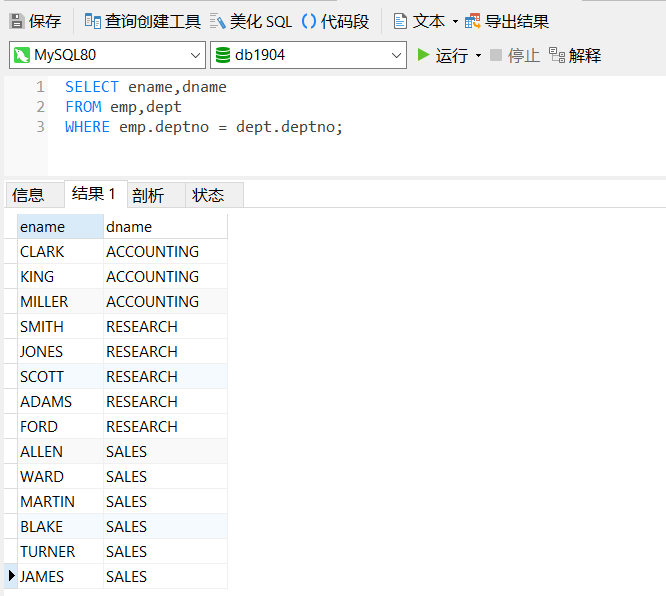
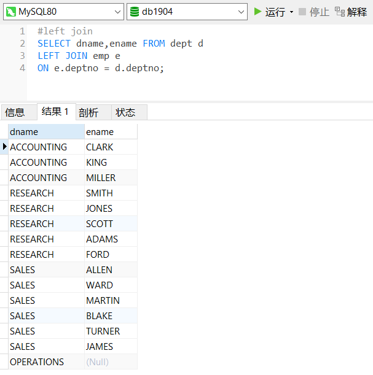

# 第2章 高级查询

### 关联查询（连接查询）

#### 笛卡尔积

> **在[数学](https://zh.wikipedia.org/wiki/数学)中，两个[集合](https://zh.wikipedia.org/wiki/集合)[X](../pics/68baa052181f707c662844a465bfeeb135e82bab-1560995846734.svg)和的**笛卡儿积**（英语：**Cartesian product），又称**直积**，在集合论中表示为，是所有可能的[有序对](https://zh.wikipedia.org/wiki/有序对)組成的集合，其中有序對的第一个对象是的成员，第二个对象是的成员。
>
> 舉個實例，如果集合是13个元素的点数集合，而集合是4个元素的花色集合♠, ♥, ♦, ♣，则这两个集合的笛卡儿积是有52个元素的标准扑克牌的集合♠♠♠♥♣♣。


#### 内联查询

> 查询员工姓名-部门名称

```mysql
SELECT ename,dname 
FROM emp,dept
WHERE emp.deptno = dept.deptno;
```



```mysql
#inner join ... on
SELECT ename,dname
FROM emp INNER JOIN dept
ON emp.deptno = dept.deptno;

#查询职位为“clerk”的员工的姓名和部门名称
SELECT ename,dname
FROM emp
INNER JOIN dept
WHERE emp.deptno = dept.deptno
AND emp.job='CLERK';


#USING
SELECT ename,dname
FROM emp INNER JOIN dept
USING (deptno)
```

#### 自然查询

> **特点**：寻找两表中字段名称相等的字段进行连接，

```mysql
SELECT 
```


#### 外连接查询

> **外连接**：有主从表之分，与连接顺序有关，以**驱动表**为依据，**匹配表**依次
>
> **左连接**：指将左表的所有记录与右表符合条件的记录，返回的结果除内连接的结果，还有左表不符合条件的记录，并在右表相应列中填NULL；
>
> **右连接：**与左外连接相反，指将右表的所有记录与左表符合条件的记录，返回的结果除内连接的结果，还有右表不符合条件的记录，并在左表相应列中填NULL；
>
> - 表A left join 表B：表A与表B匹配的行会出现在结果中，外加表A中独有的数据，未对应的数据使用null填充
> - 表A right join 表B：表A与表B匹配的行会出现在结果中，外加表B中独有的数据，未对应的数据使用null填充

```mysql
#查询所有部门中的员工信息（显示名称和部门员工的姓名）
SELECT dname,emp.ename,emp.deptno
FROM emp,dept
WHERE emp.deptno = dept.deptno

#查询员工所在部门的信息
```




#### 自身连接查询

```mysql
#查询员工及上级姓名(e1员工，e2经理)
select e1.ename 员工,e2.ename 经理 from emp e1 ,emp e2
where e1.mgr=e2.empno

select e1.ename 员工,e2.ename 经理 from emp e1 left JOIN emp e2
on e1.mgr=e2.empno
```


### 子查询

- **子查询：**即嵌套查询，将一个查询结果作为另一个查询条件或组成部分的查询；

- **单行子查询：**子查询中只有一行一列

- **多行子查询：**子查询中指查出多行一列的值   in

  - 返回多值可以使用any或者or来修饰
  - < ANY ：小于最大值，不包含最大值
  - \> ANY ：大于最小值，不包含最小值
  - < ALL  ：小于最小值
  - \> ALL  ：大于最大值
  
  ```mysql
  #查询20号部门员工工资，不包含最高工资的员工
  SELECT * FROM emp WHERE sal <ANY(
  SELECT sal FROM emp WHERE deptno=20)
  AND deptno = 20;
  ```
```mysql
  #查询薪水大于2000的部门名称
  SELECT DISTINCT dname 
  FROM dept d,emp e
  WHERE e.deptno=d.deptno
  AND e.sal>2000
  #
  SELECT dname FROM dept WHERE deptno IN
  (SELECT DISTINCT deptno FROM emp WHERE sal>2000)
  #
  SELECT dname FROM dept WHERE EXISTS
  (SELECT * FROM emp WHERE sal>2000 AND emp.deptno = dept.deptno)
```

  

### 联合查询

- UNION/UNION ALL

  ```mysql
  #union 
  SELECT * FROM emp WHERE deptno = 20   #5
  UNION
  SELECT * FROM emp WHERE sal>2000      #6
  ```

- union all (包含重复数据)