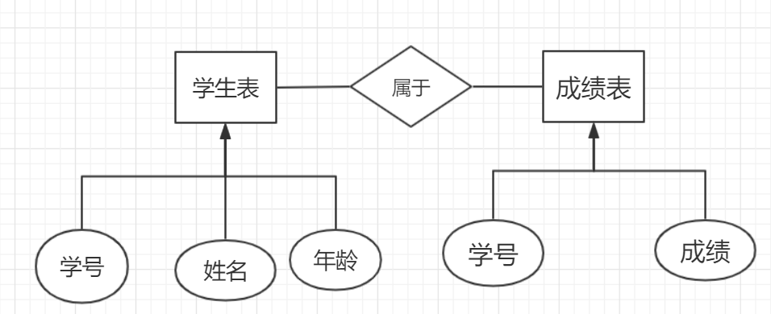

# 第4章 存储程序

> 存储程序指的一组存储和执行在数据库服务器端的程序。存储程序总是在服务器的进程或者线程的内存中执行的；

### 存储过程

#### 无参存储程序

```mysql
#查询员工信息
delimiter $      #自定义语句结束符号
CREATE PROCEDURE showEmp()
BEGIN
	SELECT * FROM emp;
END;$

#调用函数
CALL showEmp();
```


#### 有参存储程序

```mysql
#有参函数
#根据部门编号查询员工信息
delimiter $
CREATE PROCEDURE showEmps(dept_no INT)  #默认类型IN，输入参数
BEGIN
	SELECT * FROM emp WHERE deptno = dept_no;
END;$

CALL showEmps(20);
```

```mysql
#根据部门编号查询部门名称
delimiter $
CREATE PROCEDURE selDname(dno INT,OUT v_dname VARCHAR(20))
BEGIN
	SELECT dname INTO v_dname FROM dept WHERE deptno = dno;
END;$

CALL selDname(20,@dname);
SELECT @dname;

```

```mysql
#通过姓名查询job
delimiter $
CREATE PROCEDURE selJob(INOUT name_job VARCHAR(20))
BEGIN
	SELECT job INTO name_job FROM emp WHERE ename = name_job;
END;$

SET @name1 = 'scott';
CALL selJob(@name1);
SELECT @name1;

```

- commit：当确定数据更新加工完毕，需要进行存储，此时，将数据传递出去，叫提交
- rollback：当数据更改和加工时出现了异常，恢复到原来状态，叫回滚；


#### 流程控制语句

- 分支结构

  - if.....then.....end if

  ```mysql
  #输入成绩返回等级
  delimiter $
  create procedure selLevel(score INT)
  BEGIN
  	DECLARE leval VARCHAR(20);
  	IF(score>90) THEN
  	SET leval = 'A';
  	ELSEIF score >80 THEN
  	SET leval = 'B';
  	ELSEIF score >70 THEN
  	SET leval = 'C';
  	ELSE SET leval = 'D';
  	END IF;	
  	SELECT leval;
  END;$
  
  set @num = 88;
  CALL selLevel(@num);
  ```

- 循环结构

  - while(condition) do...... end while


### 存储函数

> **只有输入类型**，必须要有一个**返回值**，用于sql语句操作.

```mysql
#
delimiter //
create FUNCTION changer1(str VARCHAR(20))
RETURNS VARCHAR(20)
BEGIN
    DECLARE strname VARCHAR(20);
    SELECT lower(str) into strname; 
    return strname;
END;
#调用
select changer1('ABCD');
 
SELECT changer1(ename) from emp;

```


### 触发器

> 基于事件触发

```mysql
CREATE TABLE account_bak SELECT * FROM account WHERE 1=2;
SELECT * FROM account_bak;
#创建触发器 old   new
delimiter $
CREATE trigger delTrigger
AFTER DELETE
ON account FOR EACH ROW
BEGIN
	INSERT INTO account_bak VALUES (old.id,old.name,old.balance);
END;$

DELETE FROM account WHERE id=1;
#在account执行delete，会触发事件，将删除的数据备份到account_bak中

```


### 视图&索引

####　视图

- **视图**是一张虚拟表，并不在数据库中以存储数据集的形式存在，在引用过程中依赖于基本数据动态生成；

```mysql
#创建视图view
#在视图上修改值会对原表进行更改（emp）
#视图创建只能写查询，不能有增删改
CREATE OR REPLACE VIEW wv_emp
AS
SELECT * FROM emp WHERE deptno =30
with check option;
#视图范围内，保证修改值后仍在视图内
#在where条件时添加
```

- **好处**：
  1. 安全，有的数据列保密，
  2. 对于复杂查询，可以通过视图提高效率；
  3. 可以定制数据；
  4. 视图可以和其他表做关联查询；


#### 索引

- **索引**为了提高查询效率而创建的数据结构；

- **索引方式：**
  - BTREE：默认，B+树方式，多路搜索； 
  - HASH

- 创建索引

  ```mysql
  #创建普通索引
  CREATE INDEX ix_ename on emp(ename);
  EXPLAIN SELECT * FROM emp WHERE ename = 'scott';
  
  #创建唯一索引
  CREATE UNIQUE INDEX ix_ename on emp(ename);
  ```

- 索引的选择
  1. 适合表数据量大
  2. 适合于高基列（列的数据不一样）
  3. 适合该表不经常发生变化；
  4. 索引列不适合添加的太多
  5. 如经常用某一列作为查询条件，该列可考虑作为索引；
  6. 创建表时有主键or添加了唯一约束，就会默认添加主键索引、唯一索引；

- 面试题：

  ```mysql
  #有学生表：姓名、年龄、生日等信息，给姓名添加了索引
  #问：下面哪种查询效率更高
  SELECT * FROM student WHERE name =' ' AND age = ' '; -- √
  SELECT * FROM student WHERE age =' ' AND name = ' ';
  #查询时，将索引值查询放在前面
  ```


##### 索引分类

- **单列索引**：一个索引只包含单个列，但是一个表可以有多个单列索引。
1. 普通索引：MySQL中基本索引类型，没有什么限制，允许在定义索引的列中插入重复的值和空值，纯粹为了查询数据更快。
  
2. 唯一索引：索引列中的值必须是惟一的，但是允许为空值。
  3. 主键索引：是一种特殊的唯一索引，不允许有空值。
  
- **组合索引：**
  用表中的多个字段组合创建索引，只有在查询条件中使用了这些字段中左边的字段时，索引才会被使用，使用组合索引时遵循: 最左前缀集合。

- **全文索引：**
  全文索引，只有在MyISAM引擎中才能使用，只能在char，varchar，text类型的字段上使用。介绍了要求，说说什么是全文索引，就是在一堆文字中，通过其中的某个关键字等，就能找到该字段所属的记录行，比如有"你是个大煞笔，二货 …" 通过大煞笔，可能就可以找到该条记录。这里说的是可能，因为全文索引的使用涉及了很多细节，我们只需要知道这个大概意思。

- **空间索引：**
            1. 空间索引是对空间数据类型的字段建立的索引，MySQL中的空间数据类型有四种，GEOMETRY、POINT、LINESTRING、POLYGON。
         2. 在创建空间索引时，使用SPATIAL关键字。
            3. 要求引擎为MyISAM，创建空间索引的列，必须将其声明为NOT NULL。

### MySQL设计与优化

#### 设计

- E-R 实体-关系图
  - 矩形框—实体
  - 椭圆框—属性
  - 菱形框—关系



- 实体与实体关系
  - 1：1    一对一
  - 1：n    一对多（多对一）
  - n：n    多对多

- 三大范式

  - 一、每一列具有最小的原子单元，不能再拆分（只要是一张二维表就是第一范式）

  - 二、在第一范式基础，除了主键以外其它列和主键有关系（一张表描述一件事情）
  
  - **三**：在第二范式基础上，除了主键以外的其它列和主键有直接关系
  
  - **总结：**范式级别越高，冗余越小；查询性能会越低。
  
    

### 优化

1. SELECT子句中避免使用(\*),ORACLE在解析的过程中, 会将’\*’ 依次转换成所有的列名, 这个工作是通过查询数据字典完成的, 这意味着将耗费更多的时间

2. 索引失效的情况

​     　① Not Null/Null 如果某列建立索引,当进行Select * from emp where depto is not null/is null。 则会是索引失效。

​     　② 索引列上不要使用函数,

​         SELECT Col FROM tbl WHERE substr(name ,1 ,3 ) = ‘ABC’（不） 

​         SELECT Col FROM tbl WHERE name LIKE ‘%ABC%’ （不）

​         SELECT Col FROM tbl WHERE name LIKE ‘ABC%’ （使用）。

​     　③ 索引列上不能进行计算

​        SELECT Col FROM tbl WHERE col / 10 > 10 则会使索引失效

​        应该改成SELECT Col FROM tbl WHERE col > 10 * 10

​     　④ 索引列上不要使用NOT （ != 、 <> ）

​        如:SELECT Col FROM tbl WHERE col ! = 10 应该 

​        改成：union。

3. 用UNION替换OR(适用于索引列)

​     union:是将两个查询的结果集进行追加在一起，它不会引起列的变化。 由于是追加操作，需要两个结果集的列数应该是相关的，并且相应列的数据类型也应该相当的。

​     union 返回两个结果集，同时将两个结果集重复的项进行消除。 如果不进行消除，用UNOIN ALL.

​     通常情况下, 用UNION替换WHERE子句中的OR将会起到较好的效果. 对索引列使用OR将造成全表扫描. 

​     注意, 以上规则只针对多个索引列有效. 

​     如果有column没有被索引, 查询效率可能会因为你没有选择OR而降低. 

4. 用EXISTS替代IN、用NOT EXISTS替代NOT IN

​     在许多基于基础表的查询中, 为了满足一个条件, 往往需要对另一个表进行联接. 在这种情况下, 使用EXISTS(或NOT EXISTS)通常将提高查询的效率. 

​     在子查询中, NOT IN子句将执行一个内部的排序和合并. 无论在哪种情况下, NOT IN都是最低效的(因为它对子查询中的表执行了一个全表遍历). 

​     为了避免使用NOT IN, 我们可以把它改写成外连接(Outer Joins)或NOT EXISTS.

​     高效: SELECT * FROM EMP (基础表) WHERE EXISTS (SELECT ‘X’ FROM DEPT WHERE DEPT.DEPTNO = EMP.DEPTNO AND LOC = ‘MELB’)

​     低效: SELECT * FROM EMP (基础表) WHERE DEPTNO IN(SELECT DEPTNO FROM DEPT WHERE LOC = ‘MELB’)


### 导入导出

Mysqldump -uroot -proot dbname > d:/t.sql

mysql -uroot -p dbname < C:\backup.sql