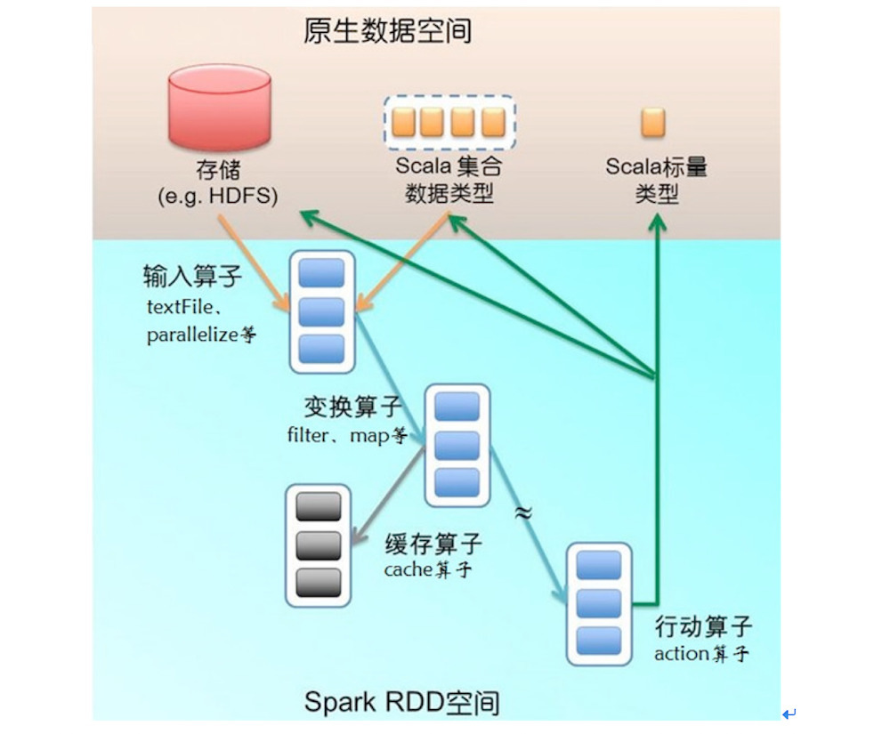
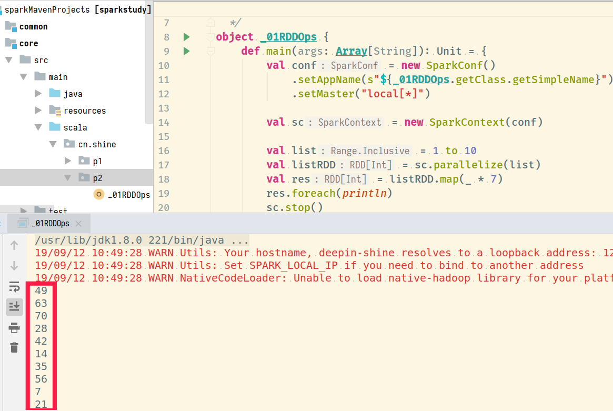

# SparkCore-RDD编程

## 1. Spark程序执行过程

### 1.1 WordCount案例程序的执行过程


### 1.2 Spark作业运行架构原理图


## RDD操作

### 2.1 RDD的初始化

> 原生API提供两种操作，一种就是读取文件`textFile()`，一种就是加载一个scala集合`parallelize`，当然也可以通过`transformation`算子来创建RDD；


### 2.2 RDD操作

> 需要知道RDD操作算子的分类，基本上分为两类，`transformation`和`action`，当然更加细致的分，可以分为输入算子，转换算子，行动算子，缓存算子；



#### 2.2.1 transformation转换算子

##### Map

- 说明：rdd.map(func) : RDD   对RDD中的每一个元素都作用一次该`func`函数，所有返回值为生成的元素构成的新的RDD

- 编码：对rdd中的每一个元素×7,变成一个新的元素
- 数据在加载过程中，被分到多个分区中的方式，采用range分区
- rdd计算过程中，shuffle的分区方式， 采用hash分区



##### flatmap

- **说明：**

    `rdd.flatMap(func) : RDD`   rdd集合中的每一个元素，都要作用`func`函数，返回0个或多个新的元素，这些新的元素共同构成一个新的RDD，所以和上述map算子进行总结：

    - 

    ```scala
    def flatMapOps(sc:SparkContext): Unit ={
    		val list = List(
    			"hello world",
    			"hi tomorrow",
    			"nononononono"
    		)
    		val listRDD = sc.parallelize(list)
    		listRDD.flatMap(line => line.split("\\s+")).foreach(println)
    	}
    ```


##### filter

- **说明**

    `rdd.filter(func):RDD`   对rdd中的每一个元素操作func操作，该函数的返回值为Boolean类型，保留返回值为True的元素

    ```scala
    def flatMapOps(sc:SparkContext): Unit ={
    		val list = List(
    			"hello world",
    			"hi tomorrow",
    			"nononononono"
    		)
    		val listRDD = sc.parallelize(list)
    		listRDD.flatMap(line => line.split("\\s+")).foreach(println)
    	}
    ```

##### sample

- **说明**

    `rdd.sample(withReplacement:Boolean,fraction:Double[,seed:Long])`   ==> 抽样，需要注意的是，spark的sample抽样不是一个精确的抽样。一个非常重要的作用就是：看rdd中数据的分布情况，根据数据分布的情况，进行各种调优与优化；

    - withReplacement：抽样的方式，有放回抽样(true)or无放回抽样(false)
    - fraction：抽样比例，取值范围（0-1）
    - seed：抽样的随机数种子

- 编码

    ```scala
    //从10万个数中抽取千分之一
    def sampleOps(sc:SparkContext): Unit ={
        val listRDD = sc.parallelize(1 to 100000)
        val smapleRdd = listRDD.sample(true,0.001)
        println("sample空间的元素个数："+smapleRdd.count())
    }
    ```

##### union

- **说明**

    rdd1.union(rdd2)，联合rdd1和rdd2中的数据，形成一个新的rdd，相当于sql中的unionall

- **编码**

    ```scala
    def unionOps(sc:SparkContext): Unit ={   
        val listRDD1 = sc.parallelize(List(1,2,3,4,5))   
        val listRDD2 = sc.parallelize(List(1,6,7,8,9))   
        val unionRDD = listRDD1.union(listRDD2)   
        unionRDD.foreach(println)
    }
    ```

##### join

- **说明**

    join就是SQL中的`inner join`，join的效果总共7种

    

- 从具体写法有如下几种：

    - 交叉链接

        `A a accross join B b` ==》这种操作方式会产生**笛卡尔积**，工作中一定要避免

    - 内连接

        `A a [inner] join B b [on | where]` ==》 有时候也写成`A a,B b`,等值连接，就是获取A和B的交集；

    - 外连接

        - **左外连接：**以左表为主体，查找右表中能够关联上的数据，如果关联不上则现实==null==
        - **右外连接**
        - 全连接
        - 半连接


#### 2.2.2 action行动算子


#### 2.2.3 持久化

