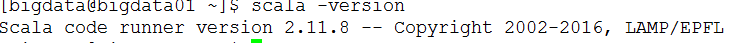
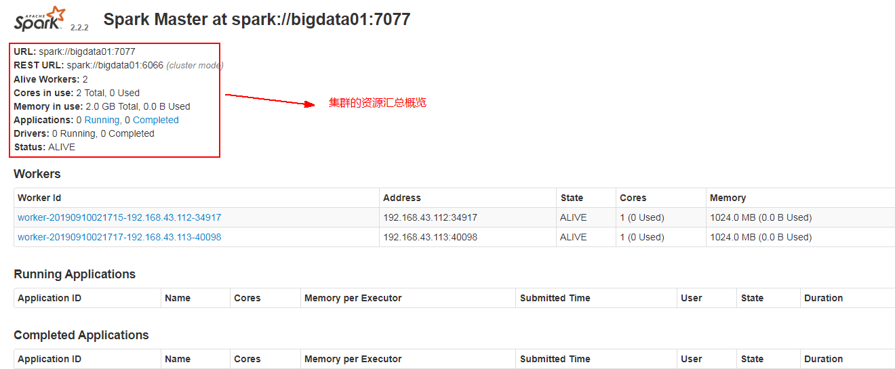
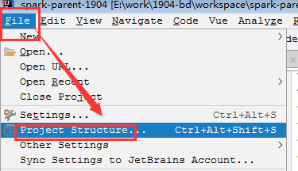

# SparkCore课堂笔记

# 0. 今日大纲

- 什么是Spark
- Spark的编程模型是什么
- Spark分布式环境安装
- Spark编程初体验

# 1. 什么是Spark

## 1.1. 大数据生态发展


## 1.2 什么是Spark

​	spark官网地址：http://spark.apache.org

​	Spark是一个通用的可扩展的处理海量数据集的计算引擎。

### 1.2.1. Spark特点

- 快

    ​	相比给予MR，官方说，基于内存计算spark要快mr100倍，基于磁盘计算spark要快mr10倍。

    

    ​	快的原因：

    	1. 基于内存计算
     	2. 计算和数据的分离
     	3. 基于DAGScheduler的计算划分
     	4. 只有一次的Shuffle输出操作

- 易用

    Spark提供超过80多个高阶算子函数，来支持对数据集的各种各样的计算，使用的时候，可以使用java、scala、python、R，非常灵活易用。

    ```python
    df = spark.read.json("logs.json") 
    df.where("age > 21")
    	.select("name.first")
        .show()
    ```

- 通用

    

- 到处运行

    

    
### 1.2.2. 人话

    	什么是Spark呢？它就是一个集成离线计算，实时计算，SQL查询，机器学习，图计算为一体的通用的计算框架。
    
    ​	何为通用？就是在一个项目中，既可以使用离线计算，也可以使用其他比如，SQL查询，机器学习，图计算等等，而这时Spark最最最强大的优势，没有之一。
    
    ​	而这一切的基础是SparkCore，速度比传统的mr快的原因就是基于内存的计算。
    
    ​	Spark开发过程中，使用到的模型——RDD(Resilient Distributed Dataset, 弹性式分布式数据集)，在编程中起到了非常重要的作用。
    
    ​	何为RDD，其实RDD就是一个不可变的scala集合。从3个方面理解：
    
     1. 弹性：如果内存充足，那集合数据的存储和计算，就都在内存中完成；如果内存不足，需要有一部分数据溢出到磁盘，然后在磁盘完成存储和计算。
    
     2. 分布式：就和之前学习的分布式概念一样，一个集合的数据被拆分成多个部分，这每一个部分被称之为一个分区partition,还是一个scala的不可变的集合。
    
     3. 数据集：存放数据的集合
    
        而Spark就是对这个RDD及其集合功能算子的实现。

# 2. Spark分布式环境的安装

​	使用的Spark的版本是2.2.2，最新的版本应该2.4.4。

下载地址：https://archive.apache.org/dist/spark/spark-2.2.2/

提供的安装包：

spark-2.2.2.tgz					  ---->源码包

spark-2.2.2-bin-hadoop2.7.tgz		---->安装包

## 2.1. 基于windows的Spark体验

- 解压

    

- 启动%SPARK_HOME%\bin目录spark-shell.cmd/spark-shell2.cmd脚本

    

- 玩

    ```scala
    scala> sc.textFile("E:/data/hello.txt")
    .flatMap(_.split("\\s+"))
    .map((_, 1))
    .reduceByKey(_+_)
    .foreach(println)
    ```

    看到结果输出

    

    同时观察到了web-ui的变化

    

    能够得出的基本结论是什么？

    1. Spark的application，可以有非常多的job作业，和mr不同，一个应用就提交一个job就行。

    2. job的执行，好像得需要某些操作触发，否则不会执行，触发的操作就是spark作业执行的动因。

    3. spark job作业的执行是分stage阶段的

        

    4. spark job作业的执行stage阶段形成了一个stage的DAG有向无环图

        

## 2.2. Spark分布式环境安装

### 2.2.1. 安装scala

1. 解压

    ```sh
    [bigdata@bigdata01 ~]$ tar -zxvf soft/scala-2.11.8.tgz -C app/
    ```

2. 重命名

    ```sh
    [bigdata@bigdata01 ~]$ mv app/scala-2.11.8/ app/scala
    ```

3. 添加环境变量

    在当前用户的环境变量配置文件中添加环境变量

    ```sh
    [bigdata@bigdata01 ~]$ vim ~/.bash_profile 
    ```

    添加如下内容

    ```sh
    export SCALA_HOME=/home/bigdata/app/scala
    export PATH=$PATH:$SCALA_HOME/bin
    ```

4. 配置文件生效

    ```sh
    [bigdata@bigdata01 ~]$ source ~/.bash_profile
    ```

5. 验证

    

### 2.2.2. 安装Spark

1. 解压

    ```sh
    [bigdata@bigdata01 ~]$ tar -zxvf soft/spark-2.2.2-bin-hadoop2.7.tgz -C app/
    ```

2. 重命名

    ```sh
    [bigdata@bigdata01 ~]$ mv app/spark-2.2.2-bin-hadoop2.7/ app/spark
    ```

3. 添加环境变量

    在当前用户的环境变量配置文件中添加环境变量

    ```sh
    [bigdata@bigdata01 ~]$ vim ~/.bash_profile 
    ```

    添加如下内容

    ```sh
    export SPARK_HOME=/home/bigdata/app/spark
    export PATH=$PATH:$SPARK_HOME/bin:$SPARK_HOME/sbin
    ```

4. 环境变量生效

    ```sh
    [bigdata@bigdata01 ~]$ source ~/.bash_profile
    ```

5. 修改配置文件

    spark的配置文件，在$SPARK_HOME/conf目录下

    1）、拷贝slaves和spark-env.sh文件

    ```sh
    [bigdata@bigdata01 conf]$ cp slaves.template slaves
    [bigdata@bigdata01 conf]$ cp spark-env.sh.template spark-env.sh
    ```

    2)、修改slaves配置

    配置spark的从节点的主机名，spark中的从节点叫做worker，主节点叫做Master

    ```sh
    [bigdata@bigdata01 conf]$ vim slaves
    bigdata02
    bigdata03
    ```

    3）、修改spark-env.sh文件

    添加如下内容：

    ```sh
    export JAVA_HOME=/opt/jdk
    export SCALA_HOME=/home/bigdata/app/scala
    export SPARK_MASTER_IP=bigdata01
    export SPARK_MASTER_PORT=7077 ##rpc通信端口，类似hdfs的9000端口，不是50070
    export SPARK_WORKER_CORES=2
    export SPARK_WORKER_INSTANCES=1
    export SPARK_WORKER_MEMORY=1g
    export HADOOP_CONF_DIR=/home/bigdata/app/hadoop/etc/hadoop
    ```

    4)、同步scala和spark到其它节点中

    ```sh
    scp -r /home/bigdata/app/scala bigdata@bigdata02:/home/bigdata/app
    scp -r /home/bigdata/app/scala bigdata@bigdata03:/home/bigdata/app
    
    scp -r /home/bigdata/app/spark bigdata@bigdata02:/home/bigdata/app
    scp -r /home/bigdata/app/spark bigdata@bigdata03:/home/bigdata/app
    在bigdata02和bigdata03上加载好环境变量,需要source生效
    scp ~/.bash_profile bigdata@bigdata02:/home/bigdata
    scp ~/.bash_profile bigdata@bigdata03:/home/bigdata
    ```

### 2.2.2. 启动并体验

1. 启动

    使用$SPARK_HOME/sbin目录下的脚本start-all.sh，和hadoop中的启动脚本重名，所以建议修改之。

    ```sh
    [bigdata@bigdata01 spark]$ mv sbin/start-all.sh sbin/start-spark-all.sh
    ```

    启动命令便成为了：

    start-spark-all.sh

    

2. 停止

    使用$SPARK_HOME/sbin目录下的脚本stop-all.sh

    ```sh
    [bigdata@bigdata01 spark]$ mv sbin/stop-all.sh sbin/stop-spark-all.sh
    ```

    停止命令便成为了：

    stop-spark-all.sh

3. 验证

    启动起来之后，spark的主节点master会类似resourcemanager提供一个web的ui，访问地址为：

    http://master-ip:8080

    

## 2.3. Spark HA的环境安装

​	因为在目前情况下，集群中只有一个Master，如果master挂掉，便无法对外提供新的服务，显然有单点故障问题，解决方法就是master的ha。

​	有两种方式解决单点故障，一种基于文件系统FileSystem(生产中不用)，还有一种基于Zookeeper(使用)。

​	配置基于Zookeeper的一个ha是非常简单的，只需要在spark-env.sh中添加一句话即可。

```sh
export SPARK_DAEMON_JAVA_OPTS="-Dspark.deploy.recoveryMode=ZOOKEEPER -Dspark.deploy.zookeeper.url=bigdata01:2181,bigdata02:2181,bigdata03:2181 -Dspark.deploy.zookeeper.dir=/spark"
```

spark.deploy.recoveryMode设置成 ZOOKEEPER
spark.deploy.zookeeper.urlZooKeeper URL
spark.deploy.zookeeper.dir ZooKeeper 保存恢复状态的目录，缺省为 /spark

​	因为ha不确定master在bigdata01上面启动，所以将

export SPARK_MASTER_IP=bigdata01和export SPARK_MASTER_PORT=7077注释掉

​	最后别忘了，同步spark-env.sh到其它机器。

同步完毕之后，重启spark集群！

bigdata01的master状态


bigdata02也启动master

start-master.sh，其状态为：


ha验证，要干掉alive的master，观察standby的master

bigdata02的状态缓慢的有standby转变为alive


## 2.4. 动态增删一个worker节点到集群

- 上线一个节点

    不需要在现有集群的配置上做任何修改，只需要准备一台worker机器即可，可和之前的worker的配置相同。

    

    ```sh
    [bigdata@bigdata01 spark]$ sbin/start-slave.sh  -c 4 -m 1000M -p 11111  spark://bigdata02:7077
    ```

- 下线一个节点

    kill或者stop-slave.sh都可以


# 3. Spark核心概念

## 3.1. 名词解释

1. ClusterManager：在Standalone(上述安装的模式，也就是依托于spark集群本身)模式中即为Master（主节点），控制整个集群，监控Worker。在YARN模式中为资源管理器ResourceManager。

2. Worker：从节点，负责控制计算节点，启动Executor。在YARN模式中为NodeManager，负责计算节点的控制，启动的进程叫Container。

3. **Driver**：运行Application的main()函数并创建SparkContext(是spark中最重要的一个概念，是spark编程的入口，作用相当于mr中的Job)。

4. **Executor**：执行器，在worker node上执行任务的组件、用于启动线程池运行任务。每个Application拥有独立的一组Executors。

5. **SparkContext**：整个应用的上下文，控制应用的生命周期，是spark编程的入口。

6. **RDD**：Spark的基本计算单元，一组RDD可形成执行的有向无环图RDD Graph。

    RDD是弹性式分布式数据集，理解从3个方面去说：弹性、数据集、分布式。

    是Spark的第一代的编程模型。

7. **DAGScheduler**：实现将Spark作业分解成一到多个Stage，每个Stage根据RDD的Partition个数决定Task的个数，然后生成相应的Task set放到TaskScheduler中。

    DAGScheduler就是Spark的大脑，中枢神经。

8. **TaskScheduler**：将任务（Task）分发给Executor执行。

9. Stage：一个Spark作业一般包含一到多个Stage。

10. Task：一个Stage包含一到多个Task，通过多个Task实现并行运行的功能。

    task的个数由rdd的partition分区决定，spark是一个分布式计算程序，所以一个大的计算任务，就会被拆分成多个小的部分，同时进行计算。

11. **Transformations**：转换(Transformations) (如：map, filter, groupBy, join等)，Transformations操作是Lazy的，也就是说从一个RDD转换生成另一个RDD的操作不是马上执行，Spark在遇到Transformations操作时只会记录需要这样的操作，并不会去执行，需要等到有Actions操作的时候才会真正启动计算过程进行计算。

12. **Actions**：操作/行动(Actions)算子 (如：count, collect, foreach等)，Actions操作会返回结果或把RDD数据写到存储系统中。**Actions是触发Spark启动计算的动因。**

13. SparkEnv：线程级别的上下文，存储运行时的重要组件的引用。SparkEnv内创建并包含如下一些重要组件的引用。

14. MapOutPutTracker：负责Shuffle元信息的存储。

15. BroadcastManager：负责广播变量的控制与元信息的存储。

16. BlockManager：负责存储管理、创建和查找块。

17. MetricsSystem：监控运行时性能指标信息。

18. **SparkConf**：负责存储配置信息。作用相当于hadoop中的Configuration。

## 3.2. Spark组件官网说明


>    Spark applications run as independent sets of processes on a cluster, coordinated by the `SparkContext` object in your main program (called the *driver program*).
>
>    Specifically, to run on a cluster, the SparkContext can connect to several types of *cluster managers* (either Spark’s own standalone cluster manager, Mesos or YARN), which allocate resources across applications. Once connected, Spark acquires *executors* on nodes in the cluster, which are processes that run computations and store data for your application. Next, it sends your application code (defined by JAR or Python files passed to SparkContext) to the executors. Finally, SparkContext sends *tasks* to the executors to run.

# 4. Spark编程初体验

## 4.1. Spark项目的创建

​	说明一点，这里创建的项目，比之前稍微复杂一点点--基于maven的聚合和继承项目。

- 创建父模块

    

    指定maven坐标

    

    执行项目的存储位置

    

    注意：父模块，一般不做开发，也就可以删除src相关目录；主要的作用就是用来管理所有的子模块，管理整个项目中使用到的依赖及其版本。

    删除src目录

    

    maven依赖，先不管理。

- 创建子目录--通用common

    右键项目名称，创建Module

    

    跳过，不用选择archetype骨架

    

    指定子模块的坐标

    

    指定子模块的存储位置

    

    此时查看项目父模块的pom文件，多了一个module

    ```xml
    <?xml version="1.0" encoding="UTF-8"?>
    <project xmlns="http://maven.apache.org/POM/4.0.0"
             xmlns:xsi="http://www.w3.org/2001/XMLSchema-instance"
             xsi:schemaLocation="http://maven.apache.org/POM/4.0.0 http://maven.apache.org/xsd/maven-4.0.0.xsd">
        <modelVersion>4.0.0</modelVersion>
    
        <groupId>com.desheng.bigdata</groupId>
        <artifactId>spark-parent-1904</artifactId>
        <packaging>pom</packaging>
        <version>1.0-SNAPSHOT</version>
        <modules>
            <module>common</module>
        </modules>
    </project>
    ```

- 创建子模块--sparkcore

    右键项目名称，创建Module

    

    跳过，不用选择archetype骨架

    

    指定子模块的坐标

    

    指定子模块存储位置

    

    同理在parent的pom中自然又会多出一个module

    ```xml
    <modules>
        <module>common</module>
        <module>core</module>
    </modules>
    ```

- 指定项目的依赖

    在木模块中添加依赖

    

    查看子模块的变化

    

    好处是，子模块里面就可以拥有父模块所有的依赖，坏处是强迫所有的子模块继承所有依赖。所以我们在生产环境中要做到有选择性的继承。所以就需要将父模块的依赖管理(有个标签dependencyManagement)起来，不能随随便便的让子模块就都继承。

    

    如上图是还没有重新导入依赖。现在开始导入依赖：

    

    子模块之前的依赖消失了：

    

    自然之前编写的相关逻辑就会报错，因为找不到依赖了：

    

    有选择的继承依赖

    

- 处理spark的依赖

    1. 父模块完整的pom依赖

        ```xml
        <?xml version="1.0" encoding="UTF-8"?>
        <project xmlns="http://maven.apache.org/POM/4.0.0"
                 xmlns:xsi="http://www.w3.org/2001/XMLSchema-instance"
                 xsi:schemaLocation="http://maven.apache.org/POM/4.0.0 http://maven.apache.org/xsd/maven-4.0.0.xsd">
            <modelVersion>4.0.0</modelVersion>
        
            <groupId>com.desheng.bigdata</groupId>
            <artifactId>spark-parent-1904</artifactId>
            <packaging>pom</packaging>
            <version>1.0-SNAPSHOT</version>
            <properties>
                <scala.version>2.11.8</scala.version>
                <spark.version>2.2.2</spark.version>
            </properties>
            <modules>
                <module>common</module>
                <module>core</module>
            </modules>
        
            <dependencyManagement>
                <dependencies>
                    <dependency>
                        <groupId>junit</groupId>
                        <artifactId>junit</artifactId>
                        <version>4.12</version>
                    </dependency>
        
                    <!-- scala去除
                    <dependency>
                        <groupId>org.scala-lang</groupId>
                        <artifactId>scala-library</artifactId>
                        <version>${scala.version}</version>
                    </dependency>  -->
                    <!-- sparkcore -->
                    <dependency>
                        <groupId>org.apache.spark</groupId>
                        <artifactId>spark-core_2.11</artifactId>
                        <version>${spark.version}</version>
                    </dependency>
                    <!-- sparksql -->
                    <dependency>
                        <groupId>org.apache.spark</groupId>
                        <artifactId>spark-sql_2.11</artifactId>
                        <version>${spark.version}</version>
                    </dependency>
                    <!-- sparkstreaming -->
                    <dependency>
                        <groupId>org.apache.spark</groupId>
                        <artifactId>spark-streaming_2.11</artifactId>
                        <version>${spark.version}</version>
                    </dependency>
                </dependencies>
            </dependencyManagement>
        </project>
        ```

    2. common的pom文件

        ```xml
        <?xml version="1.0" encoding="UTF-8"?>
        <project xmlns="http://maven.apache.org/POM/4.0.0"
                 xmlns:xsi="http://www.w3.org/2001/XMLSchema-instance"
                 xsi:schemaLocation="http://maven.apache.org/POM/4.0.0 http://maven.apache.org/xsd/maven-4.0.0.xsd">
            <parent>
                <artifactId>spark-parent-1904</artifactId>
                <groupId>com.desheng.bigdata</groupId>
                <version>1.0-SNAPSHOT</version>
            </parent>
            <modelVersion>4.0.0</modelVersion>
        
            <artifactId>common</artifactId>
        
            <dependencies>
                <dependency>
                    <groupId>junit</groupId>
                    <artifactId>junit</artifactId>
                </dependency>
            </dependencies>
        </project>
        ```

    3. core的pom文件

        ```xml
        <?xml version="1.0" encoding="UTF-8"?>
        <project xmlns="http://maven.apache.org/POM/4.0.0"
                 xmlns:xsi="http://www.w3.org/2001/XMLSchema-instance"
                 xsi:schemaLocation="http://maven.apache.org/POM/4.0.0 http://maven.apache.org/xsd/maven-4.0.0.xsd">
            <parent>
                <artifactId>spark-parent-1904</artifactId>
                <groupId>com.desheng.bigdata</groupId>
                <version>1.0-SNAPSHOT</version>
            </parent>
            <modelVersion>4.0.0</modelVersion>
            <artifactId>core</artifactId>
            <dependencies>
                <dependency>
                    <groupId>org.apache.spark</groupId>
                    <artifactId>spark-core_2.11</artifactId>
                </dependency>
        
            <!-- 因为sparkcore内部已经集成了scala-library，所以就不需要在导入该包了
                <dependency>
                    <groupId>org.scala-lang</groupId>
                    <artifactId>scala-library</artifactId>
                </dependency>-->
            </dependencies>
        </project>
        ```

## 4.2. 项目编码

### 4.2.1. 添加模块为scala项目

第一步，在src下面创建一个scala目录，用于编写scala代码，并且将scala的目录指定为source root


发现无法直接创建scala的class，已经拥有了scala的依赖，


修改project structure，添加scala模块到core中


删除并重新添加


### 4.2.2. 项目具体的代码

​	需要注意的是，入口类为SparkContext。

​	不同版本有不同的SparkContext，java版本的是JavaSparkContext，scala的版本就是SparkContext；SparkSQL的入口有SQLContext、HiveContext；SparkStreaming的入口又是StreamingContext。

- java版本

    ```jav
    /*
        通过本案例来做入门程序
        编程错误一：
            A master URL must be set in your configuration
        编程错误二：
            An application name must be set in your configuration
     */
    public class JavaSparkWordCountOps {
        public static void main(String[] args) {
            //step 1、创建编程入口类
            SparkConf conf = new SparkConf();
            conf.setMaster("local[*]");
            conf.setAppName(JavaSparkWordCountOps.class.getSimpleName());
    
            JavaSparkContext jsc = new JavaSparkContext(conf);
    
            //step 2、加载外部数据 形成spark中的计算的编程模型RDD
            JavaRDD<String> linesRDD = jsc.textFile("E:/data/hello.txt");
    //        linesRDD.foreach(new VoidFunction<String>() {
    //            public void call(String s) throws Exception {
    //                System.out.println(s);
    //            }
    //        });
            // step 3、对加载的数据进行各种业务逻辑操作---转换操作transformation
            JavaRDD<String> wordsRDD = linesRDD.flatMap(new FlatMapFunction<String, String>() {
                public Iterator<String> call(String line) throws Exception {
                    return Arrays.asList(line.split("\\s+")).iterator();
                }
            });
            System.out.println("-----经过拆分之后的rdd数据----");
    //        wordsRDD.foreach(new VoidFunction<String>() {
    //            public void call(String s) throws Exception {
    //                System.out.println(s);
    //            }
    //        });
            System.out.println("-----word拼装成键值对----");
            JavaPairRDD<String, Integer> pairsRDD = wordsRDD.mapToPair(new PairFunction<String, String, Integer>() {
                public Tuple2<String, Integer> call(String word) throws Exception {
                    return new Tuple2<String, Integer>(word, 1);
                }
            });
    //        pairsRDD.foreach(new VoidFunction<Tuple2<String, Integer>>() {
    //            public void call(Tuple2<String, Integer> t) throws Exception {
    //                System.out.println(t._1 + "--->" + t._2);
    //            }
    //        });
            System.out.println("------按照相同的key，统计value--------------");
            JavaPairRDD<String, Integer> retRDD = pairsRDD.reduceByKey(new Function2<Integer, Integer, Integer>() {
                public Integer call(Integer v1, Integer v2) throws Exception {
                    int i = 1 / 0; //印证出这些转换的transformation算子是懒加载的，需要action的触发
                    return v1 + v2;
                }
            });
            retRDD.foreach(new VoidFunction<Tuple2<String, Integer>>() {
                public void call(Tuple2<String, Integer> t) throws Exception {
                    System.out.println(t._1 + "--->" + t._2);
                }
            });
        }
    }
    ```

- java-lambda版本

    ```java
    public class LambdaSparkWordCountOps {
        public static void main(String[] args) {
            //step 1、创建编程入口类
            SparkConf conf = new SparkConf();
            conf.setMaster("local[*]");
            conf.setAppName(LambdaSparkWordCountOps.class.getSimpleName());
    
            JavaSparkContext jsc = new JavaSparkContext(conf);
    
            //step 2、加载外部数据 形成spark中的计算的编程模型RDD
            JavaRDD<String> linesRDD = jsc.textFile("E:/data/hello.txt");
    
            // step 3、对加载的数据进行各种业务逻辑操作---转换操作transformation
            JavaRDD<String> wordsRDD = linesRDD.flatMap(line -> Arrays.asList(line.split("\\s+")).iterator());
            System.out.println("-----经过拆分之后的rdd数据----");
    
            System.out.println("-----word拼装成键值对----");
            JavaPairRDD<String, Integer> pairsRDD = wordsRDD.mapToPair(word -> new Tuple2<String, Integer>(word, 1));
    
            System.out.println("------按照相同的key，统计value--------------");
            JavaPairRDD<String, Integer> retRDD = pairsRDD.reduceByKey((v1, v2) -> v1 + v2);
            retRDD.foreach(t -> System.out.println(t._1 + "--->" + t._2));
        }
    }
    ```

    这里需要注意一个问题，将java的sdk的版本提高到至少1.8.在pom中加入如下的内容即可：

    ```xml
    <properties>
        <maven.compiler.source>1.8</maven.compiler.source>
        <maven.compiler.target>1.8</maven.compiler.target>
    </properties>
    ```

- scala版本--基础版本

    ```sc
    object SparkWordCountOps {
        def main(args: Array[String]): Unit = {
            val conf = new SparkConf()
                    .setMaster("local[*]")
                    .setAppName("SparkWordCount")
            val sc = new SparkContext(conf)
    
            //load data from file
            val linesRDD:RDD[String] = sc.textFile("E:/data/hello.txt")
            val wordsRDD:RDD[String] = linesRDD.flatMap(line => line.split("\\s+"))//正则表达式
    
            val pairsRDD:RDD[(String, Int)] = wordsRDD.map(word => (word, 1))
            val ret = pairsRDD.reduceByKey((v1, v2) => v1 + v2)
            ret.foreach(t => println(t._1 + "---" + t._2))
            sc.stop()
        }
    }
    ```

- scala--标准版

    ```scala
    object SparkWordCountOps {
        def main(args: Array[String]): Unit = {
            val conf = new SparkConf()
                    .setMaster("local[*]")
                    .setAppName("SparkWordCount")
            val sc = new SparkContext(conf)
    
            //load data from file
            val linesRDD:RDD[String] = sc.textFile("E:/data/hello.txt")
            val ret = linesRDD.flatMap(_.split("\\s+")).map((_, 1)).reduceByKey(_ + _)
            //模式匹配--->元组、数组、list
    //        ret.foreach(t => {
    //            t match {
    //                case (word, count) => {
    //                    println(word + "---" + count)
    //                }
    //                case _ => {
    //                    println("fadfadfsadf")
    //                }
    //            }
    //        })
            
            ret.foreach{case (word, count) => println(word + "---" + count)}
            sc.stop()
        }
    }
    ```

### 4.2.3. Master URL

​	首先在编程过程中，至少需要给spark程序传递一个参数master-url，通过sparkConf.setMaster来完成。改参数，代表的是spark作业的执行方式，或者指定的spark程序的cluster-manager的类型。

| master                                    | 含义                                                         |
| ----------------------------------------- | ------------------------------------------------------------ |
| local                                     | 程序在本地运行，同时为本地程序提供一个线程来处理             |
| local[M]                                  | 程序在本地运行，同时为本地程序分配M个工作线程来处理          |
| local[*]                                  | 程序在本地运行，同时为本地程序分配机器可用的CPU core的个数工作线程来处理 |
| local[M, N]                               | 程序在本地运行，同时为本地程序分配M个工作线程来处理,如果提交程序失败，会进行最多N次的重试 |
| spark://ip:port                           | 基于standalone的模式运行，提交撑到ip对应的master上运行       |
| spark://ip1:port1,ip2:port2               | 基于standalone的ha模式运行，提交撑到ip对应的master上运行     |
| yarn/启动脚本中的deploy-mode配置为cluster | 基于yarn模式的cluster方式运行,SparkContext的创建在NodeManager上面，在yarn集群中 |
| yarn/启动脚本中的deploy-mode配置为client  | 基于yarn模式的client方式运行,SparkContext的创建在提交程序的那台机器上面，不在yarn集群中 |

## 4.3. spark日志的管理

- 全局管理

    就是项目classpath下面引入log4j.properties配置文件进行管理

    ```properties
    # 基本日志输出级别为INFO，输出目的地为console
    log4j.rootCategory=INFO, console
    
    log4j.appender.console=org.apache.log4j.ConsoleAppender
    log4j.appender.console.target=System.err
    log4j.appender.console.layout=org.apache.log4j.PatternLayout
    log4j.appender.console.layout.ConversionPattern=%d{yy/MM/dd HH:mm:ss} %p %c{1}: %m%n
    
    # 输出配置的是spark提供的webui的日志级别
    log4j.logger.org.spark_project.jetty=INFO
    log4j.logger.org.spark_project.jetty.util.component.AbstractLifeCycle=ERROR
    log4j.logger.org.apache.spark.repl.SparkIMain$exprTyper=INFO
    log4j.logger.org.apache.spark.repl.SparkILoop$SparkILoopInterpreter=INFO
    log4j.logger.org.apache.parquet=ERROR
    log4j.logger.parquet=ERROR
    ```

- 局部管理

    就是在当前类中进行日志的管理。

    ```scala
    import org.apache.log4j.{Level, Logger}
    
    Logger.getLogger("org.apache.spark").setLevel(Level.WARN)
    Logger.getLogger("org.apache.hadoop").setLevel(Level.WARN)
    Logger.getLogger("org.spark_project").setLevel(Level.WARN)
    ```

## 4.4. spark程序的其它提交方式

### 4.4.1. 加载hdfs中的文件

```scala
object RemoteSparkWordCountOps {
    def main(args: Array[String]): Unit = {
        val conf = new SparkConf()
                .setMaster("local[*]")
                .setAppName("SparkWordCount")
        val sc = new SparkContext(conf)
        //load data from file
        val linesRDD:RDD[String] = sc.textFile("hdfs://ns1/data/spark/hello.txt")

        val ret = linesRDD.flatMap(_.split("\\s+")).map((_, 1)).reduceByKey(_ + _)
        ret.foreach{case (word, count) => println(word + "---" + count)}
        sc.stop()
    }
}
```

出现如下问题：

> java.lang.IllegalArgumentException: java.net.UnknownHostException: ns1

解决方案，最简单的就是将hadoop的两个配置文件core-site.xml和hdfs-site.xml添加到项目的classpath中即可。

但是此时在此基础之上，将textFile去加载本地的文件

```scala
sc.textFile("E:/data/hello.txt")
```

则会报错：

> java.lang.IllegalArgumentException: Pathname /E:/data/hello.txt from hdfs://ns1/E:/data/hello.txt is not a valid DFS filename

原因就在于，已经在classpath下面加载了hdfs-site.xml和core-site.xml的配置文件，则会自动理解输入的文件路径为hdfs的，自然会报错。所以，在此情况下还想加载本地文件，那么就告诉机器以本地文件的格式或者协议读取即可

```scala
val linesRDD:RDD[String] = sc.textFile("file:/E:/data/hello.txt")
```

### 4.4.2 提交spark程序到集群中

- 程序打包 --->基于命令行的打包方式

    0. maven的声明周期

        maven的声明周期主要有3大声明周期：

        Clean	---->清理项目根目录下面的target中的数据

        ​	clean

        Default

        ​	compile	--->编译，把.java/.scala编译成.class

        ​	test	   --->测试，执行src/test/java|scala目录中的单元测试

        ​	package	——->打包，把这一堆.class和配置文件打包成一个.jar包

        ​	install	--->安装，把package生成的.jar安装到maven的本地仓库，只能当前机器可以依赖

        ​	deploy	 --->部署，把install安装的.jar发布到maven的私服或者中央仓库中，这样互联网上的程序员都可以依赖的

        Site

        ​	site	   --->站点，编码完成之后，生成本项目中的站点信息，比如开发者都有谁，项目简介是什么，公司简介，公司url地址等等。

        上述生命周期中的构建命令，执行顺序依次为：clean compile test package install deploy

        执行特点：一步构建，执行顺序后面的命令，会自动执行前面的构建操作。

    1. 不需要第三方依赖

        直接在项目的根目录下面执行如下命令：

        > mvn package -DskipTests

    2. 需要第三方依赖

        此时就需要在pom中添加一个第三方的插件来完成打包

        ```xml
        <build>
            <sourceDirectory>src/main/scala</sourceDirectory>
            <plugins>
                <!-- 对第三方依赖进行打包-->
                <plugin>
                    <artifactId>maven-assembly-plugin</artifactId>
                    <configuration>
                        <descriptorRefs>
                            <!-- 打好的jar以jar-with-dependencies结尾 -->
                            <descriptorRef>jar-with-dependencies</descriptorRef>
                        </descriptorRefs>
                        <archive>
                            <!--<manifest>
                                  <mainClass></mainClass>
                                </manifest>-->
                        </archive>
                    </configuration>
                    <executions>
                        <execution>
                            <id>make-assembly</id>
                            <phase>package</phase>
                            <goals>
                                <goal>single</goal>
                            </goals>
                        </execution>
                    </executions>
                </plugin>
                <plugin>
                    <groupId>org.scala-tools</groupId>
                    <artifactId>maven-scala-plugin</artifactId>
                    <executions>
                        <execution>
                            <goals>
                                <goal>compile</goal>
                                <goal>testCompile</goal>
                            </goals>
                        </execution>
                    </executions>
                    <configuration>
                        <scalaVersion>${scala.version}</scalaVersion>
                        <args>
                            <arg>-target:jvm-1.5</arg>
                        </args>
                    </configuration>
                </plugin>
                <plugin>
                    <groupId>org.apache.maven.plugins</groupId>
                    <artifactId>maven-eclipse-plugin</artifactId>
                    <configuration>
                        <downloadSources>true</downloadSources>
                        <buildcommands>
                            <buildcommand>ch.epfl.lamp.sdt.core.scalabuilder</buildcommand>
                        </buildcommands>
                        <additionalProjectnatures>
                            <projectnature>ch.epfl.lamp.sdt.core.scalanature</projectnature>
                        </additionalProjectnatures>
                        <classpathContainers>
                            <classpathContainer>org.eclipse.jdt.launching.JRE_CONTAINER</classpathContainer>
                            <classpathContainer>ch.epfl.lamp.sdt.launching.SCALA_CONTAINER</classpathContainer>
                        </classpathContainers>
                    </configuration>
                </plugin>
            </plugins>
        </build>
        ```

        执行命令：

        > mvn clean package -DskipTests

    一个思考的问题：服务器已经有了spark的依赖包，在上述的打包过程中又把spark的依赖包打了一遍，多余，还有可能因为版本不一致，造成版本冲突？

    通常的解决方式，不要将集群中已经存在的依赖打进去。

    > ```
    > scope表示当前的依赖的作用域，常见有4个取值范围：
    > compiled : 默认的取值范围，当前的依赖在源码期，编译器，运行期都有效
    > test     : 只在src/test/*下面有效
    > provided : 表示当前依赖已经被提供了，所以只在源码编写期，编译器有效，运行期不起作用
    > runtime  : 表示当前依赖只在运行期使用，在源码，编译器无效,mysql驱动包
    > ```

    ```xml
    <dependency>
        <groupId>org.apache.spark</groupId>
        <artifactId>spark-core_2.11</artifactId>
        <scope>provided</scope>
    </dependency>
    ```

    上述打包方式太啰嗦，如果不需要第三方依赖的打包的话，直接使用idea打包：

    进入project structure

    

    选择artifacts创建jar

    

    起jar名称，选择打包的依赖

    

    选择build artifacts

    

    选择build对应的artifact

    

    会在项目的根目录下面生成一个out目录，在该目录中就存放这build的artifact，文件夹名称就是前面起的名字

    

    打包完成

- 提交standalone

    在追踪spark-shell提交程序的代码过程中，发现执行了如下一句话：

    

    所以，spark程序提交到集群，就应该是通过spark-submit脚本来完成的。

    spark-submi-wc-local脚本

    ```sh
    #!/bin/sh
    
    SPARK_HOME=/home/bigdata/app/spark
    
    ${SPARK_HOME}/bin/spark-submit \
    --class com.desheng.bigdata.spark.p1.RemoteSparkWordCountOps \
    --master local \
    /home/bigdata/jars/spark/1904-bd/spark-wc.jar \
    hdfs://ns1/data/spark/hello.txt
    ```

    spark-submit-wc-standalone.sh

    ```sh
    #!/bin/sh
    
    SPARK_HOME=/home/bigdata/app/spark
    
    ${SPARK_HOME}/bin/spark-submit \
    --class com.desheng.bigdata.spark.p1.RemoteSparkWordCountOps \
    --master spark://bigdata01:7077 \
    --deploy-mode client \
    --total-executor-cores 2 \
    --executor-cores 1 \
    --executor-memory 600M \
    /home/bigdata/jars/spark/1904-bd/spark-wc.jar \
    hdfs://ns1/data/spark/hello.txt
    ```

    一个疑惑的问题，在local的方式中，可以看到foreach的结果，但是client模式下面就看不到这个结果，这是为何？

    

    ​	算子操作都是在worker中执行的，包括foreach操作，所以要想看结果就应该去worker上面查看，而不是提交作业的本机。

- 提交yarn集群

    spark基于yarn集群的运行方式，是在国内最常见的一种方式。

    1. client

        ```sh
        #!/bin/sh
        ## 脚本名称spark-submit-wc-yarn-client.sh
        export HADOOP_CONF_DIR=/home/bigdata/app/hadoop/etc/hadoop
        SPARK_HOME=/home/bigdata/app/spark
        
        ${SPARK_HOME}/bin/spark-submit \
        --class com.desheng.bigdata.spark.p1.RemoteSparkWordCountOps \
        --master yarn \
        --deploy-mode client \
        --executor-cores 1 \
        --num-executors 1 \
        --executor-memory 600M \
        /home/bigdata/jars/spark/1904-bd/spark-wc.jar \
        hdfs://ns1/data/spark/hello.txt
        ```

    2. cluster

        ```sh
        #!/bin/sh
        
        
        export HADOOP_CONF_DIR=/home/bigdata/app/hadoop/etc/hadoop
        
        SPARK_HOME=/home/bigdata/app/spark
        
        ${SPARK_HOME}/bin/spark-submit \
        --class com.desheng.bigdata.spark.p1.RemoteSparkWordCountOps \
        --master yarn \
        --deploy-mode cluster \
        --executor-cores 1 \
        --num-executors 1 \
        --executor-memory 600M \
        hdfs://ns1/jars/spark/1904-bd/spark-wc.jar \
        hdfs://ns1/data/spark/hello.txt
        ```

        注意：

        1.需要将jar的路径修改到一个各个节点能够共享的位置，因为在cluster模式下面，driver不一定在提交jar的所在机器启动，比如：

        

        现在在bigdata02上面是不可能找在01上面的jar的，所以需要将jar进行共享。

        2.大家直接基于yarn模式进行运行，肯定会报错，一般报的错误就是虚拟内存超过的物理内存这个错误。

        Container killed by YARN for exceeding memory limits. 15.6 GB of 15.5 GB physical memory used. 

        解决问题：

        在yarn-site.xml中添加如下两个配置

        ```xml
        <property>
            <name>yarn.nodemanager.pmem-check-enabled</name>
            <value>false</value>
        </property>
        <property>
            <name>yarn.nodemanager.vmem-check-enabled</name>
            <value>false</value>
        </property>
        ```

# 5. shell基本知识学习

​	我们在查看spark-shell命令，来学习如何提交一个spark作业的时候，看到了声明的一个函数main，在执行的时候这么来做：

```sh
main "$@"
```

​	其中的$@代表的是什么意思呢？还有常见的$1, $2, $#, $?, $0都分别代表什么意思呢？

编写test.sh脚本

```sh
#!/bin/sh

echo '$0: '$0
echo '$1: '$1
echo '$2: '$2
echo '$#: '$#
echo '$?: '$?
echo '$@: '$@
```

执行命令

> sh /home/bigdata/shells/test.sh aaa bbb ccc ddd eee

结果查看

> $0: /home/bigdata/shells/test.sh
> $1: aaa
> $2: bbb
> $#: 5
> $?: 0
> $@: aaa bbb ccc ddd eee

分析

$N( 0 < N): 代表返回当前脚本的第N个参数

$0		: 代表当前脚本的执行路径

$#		: 代表当前脚本接收的参数个数

$@		: 代表当前节本接收到的所有的参数

$?		: 代表上一条命令执行是否成功，或者是函数的返回值，0为成功，非0为异常