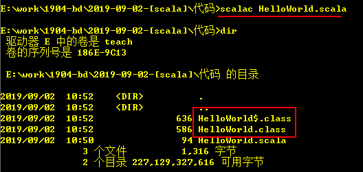

# Scala课堂笔记

# 0. 今日大纲

- Scala简介

- Scala安装验证

- Scala IDE

- Scala基础知识和语法

- Scala控制结构

- Scala函数

- Scala数组&集合

# 1. Scala简介

   Scala是一门多范式（multi-paradigm）的编程语言，设计初衷是要集成面向对象编程和函数式编程的各种特性。
   Scala运行在Java虚拟机上，并兼容现有的Java程序。
   Scala源代码被编译成Java字节码，所以它可以运行于JVM之上，并可以调用现有的Java类库。
   函数编程范式更适合用于Map/Reduce和大数据模型，它摒弃了数据与状态的计算模型，着眼于函数本身，而非执行的过程的数据和状态的处理。函数范式逻辑清晰、简单，非常适合用于处理基于不变数据的批量处理工作，这些工作基本都是通过map和reduce操作转换数据后，生成新的数据副本，然后再进行处理。
   像Spark，Flink等都是采用Scala开发的，所以学习好大数据，掌握scala是必要的。
   官网：http://scala-lang.org/ 

# 2. Scala安装

1、安装JDK
2、JAVA_HOME, PATH
3、Maven
4、SCALA SDK
    下载地址：http://scala-lang.org/download/all.html
    这里选择的版本为Scala 2.11.8，分为windows和linux版本


5、配置SCALA_HOME
    在windows环境变量中添加SCALA_HOME


6、验证

> 注意：不能将scala安装在目录带空格或者中文的目录下面

# 3. Scala的IDE

## 3.0. Scala文档说明

1. 参见发放为大家的w3cschool.exe文档中的内容

2. api网址：https://scala-lang.org/files/archive/api/2.11.8/

3. 在线api帮助文档地址：http://tool.oschina.net/apidocs

## 3.1. 基本的IDE--Nodepad++

### 3.1.1. Scala第一个程序

```scala
object HelloWorld {
	def main(args:Array[String]):Unit = {	
		println("Hello World~")
	}
}
```

object 			---> 类似java中的class的结构

HelloWorld 	    --->类似java中的类名

def 	   	    --->scala中函数的标识

main			   --->类似java中的函数名，最为特殊的一个函数，是jvm虚拟机的入口

args:Array[String] --->类似java中函数的参数列表

Unit 			  --->类似java中的void			

{}				 --->类似java中函数的函数体

而scala的程序能够在jvm之上进行运行，需要进行编译：



使用scalac进行编译，编译命令和java的编译高度相似

编译之后至少产生两个.class文件，一个是类名.class，一个是类名$.class

1. 类名.class

    用于jvm虚拟机来进行调用，在这个class中调用了类名$.class的信息

    

2. 类名$.class

    主要就是服务于scala的代码信息

    

可以通过反编译工具来进行查看：jd-gui.exe

​	执行scala编译之后的.class，使用scala命令即可：


## 3.2. 高级的IDE--Idea/eclipse

### 3.2.1. 安装

​	安装省略

### 3.2.2. 创建项目

​	启动界面

​	

​	配置项


- java项目

    选择上述create New Project,进入并选择java项，同时制定jdk的JAVA_HOME

    

    不使用template直接创建

    

    指定项目存储路径

    

    创建之后的界面

    

    创建java的class

    

    编写内容

    

    tip：输入主函数的快捷键是--psvm，输入System.out.println()的快捷键是sout

    运行：右键--->Run Application即可。

    

- scala项目

    1. idea集成scala

        插件下载官网：http://plugins.jetbrains.com,需要注意的是插件的版本必须要和idea的版本保持一致！

        1）在线集成

        点击File，选择settings

        

        点击plugins，在线查找scala

        

        安装完毕之后，重启idea生效

        

        2）离线集成(推荐)

        

        点击plugins，从磁盘加载idea的插件

        

        安装完毕之后，重启idea生效

        

        重新创建项目，查看已经有了scala的模块，说明插件安装成功

        

    2. idea创建scala项目

        选择scala创建项目

        

        指定scala的sdk目录

        

        

        创建scala的object，编写内容

        

        运行和运行java-class一样

        tip：创建scala的main函数的快捷键是main

- 基于maven构建项目

    1. idea配置maven环境

    ​	因为idea内部已经集成类maven，所以不需要安装插件，只需要做基本配置即可。

    ​	选择settings

    

    ​	选择maven的路径，配置文件，仓库路径

    ​	

    2. 基于maven创建项目

        选择maven，构建项目

    

    指定maven的坐标

    

    指定项目的存储位置

    

    指定项目的依赖

    ```xml
    <properties>
        <scala.version>2.11.8</scala.version>
    </properties>
    <dependencies>
        <dependency>
            <groupId>org.scala-lang</groupId>
            <artifactId>scala-library</artifactId>
            <version>${scala.version}</version>
        </dependency>
    </dependencies>
    ```

    创建scala的源代码目录，并指定目录类型为Source root

    

    新建scala的class时候，不能直接创建，需要进行scala模块的指定--->File--->Project Structure

    

    指定scala的全局依赖

    

    编写内容，并运行

    

    注意：

    1、要求大家在windows中配置MAVEN_HOME/M2_HOME,并将其bin添加到path目录中

    2、建议大家修改一下idea中的默认的配置

    ​	指定Default Settings

    

    ​	配置修改maven

    

    tips:idea常用快捷键列表

    ​	https://www.cnblogs.com/JavaBlackHole/p/7673812.html

    3、修改idea的快捷键

    ​	在settings--->keymap中完成指定

    

    4、将项目的编码统一修改为UTF-8

    

# 3. Scala基础知识和语法

## 3.1. 语法特点

可拓展
	面向对象
	函数式编程
兼容JAVA
	类库调用
	互操作
语法简洁
	代码行短
	类型推断
	抽象控制
静态类型化
	可检验
	安全重构
支持并发控制
	强计算能力
	自定义其他控制结构

## 3.2. Scala和Java的关系

1、都是基于JVM虚拟机运行的
   Scala编译之后的文件也是.class，都要转换为字节码，然后运行在JVM虚拟机之上。
2、Scala和Java相互调用
   在Scala中可以直接调用Java的代码，同时在Java中也可以直接调用Scala的代码
3、Java 8 VS Scala
   1）Java 8（lambda）没有出来之前，Java只是面向对象的一门语言，但是Java 8出来以后，Java就是一个面向对象和面向函数的混合语言了。
   2）首先我们要对Scala进行精确定位，从某种程度上讲，Scala并不是一个纯粹的面向函数的编程语言，有人认为 Scala是一个带有闭包的静态面向对象语言），更准确地说，Scala是面向函数与面向对象的混合。
   3）Scala设计的初衷是面向函数FP，而Java起家是面向对象OO，现在两者都是OO和FP的混合语言，是否可以这么认为：Scala = FP + OO，而Java = OO+ FP？
   由于面向对象OO和面向函数FP两种范式是类似横坐标和纵坐标的两者不同坐标方向的思考方式，类似数据库和对象之间的不匹配阻抗关系，两者如果结合得不好恐怕就不会产生1+1>2的效果。
  面向对象是最接近人类思维的方式，而面向函数是最接近计算机的思维方式。如果你想让计算机为人的业务建模服务，那么以OO为主；如果你希望让计算机能自己通过算法从大数据中自动建模，那么以FP为主。所以，Java可能还会在企业工程类软件中占主要市场，而Scala则会在科学计算大数据分析等领域抢占Java市场，比如Scala的Spark大有替代Java的Hadoop之趋势。

## 3.3. Scala解释器

   Scala解释器读到一个表达式，对它进行求值，将它打印出来，接着再继续读下一个表达式。这个过程被称做读取--求值--打印--循环，即：REPL。
   从技术上讲，scala程序并不是一个解释器。实际发生的是，你输入的内容被快速地编译成字节码，然后这段字节码交由Java虚拟机执行。正因为如此，大多数scala程序员更倾向于将它称做“REPL”。


## 3.4. var和val定义变量

​	scala中定义变量，通过var或者val来进行，如果要定义一个函数，就是def。

- var

    定义的是(可变的量)变量

- val

    定义的是不可变的量，类似java中被final关键字修饰的变量，只能进行输出

    在开发过程中，建议搭建使用后者val，而不是var，除非我们操作的一个变量需要进行修改，除此以外使用val进行修饰。

    变量的定义方式：val/var aaa:Int = 3,但是scala觉得这种写法太过啰嗦，可以做自动类型的推断，所以上述的写法就可以转化为：var/val aaa = 3

## 3.5. Scala数据类型


# 4. Scala流程控制结构

## 4.1. if表达式

### 4.1.1. if表达式

​	和java中的if或者if-else或者if-elseif-else一模一样，但是有一点不同，scala的if-else有返回值。scala中的任何表达式都有返回值！

```scal
object _01IfDemo {
	def main(args:Array[String]):Unit = {	
		val age = 18
		/*
		if(age >= 18) {
			println("adult~")
		} else {
			println("kid")
		}*/
		val ret = if(age >= 18) {
			"adult~"
		} else {
			"kid"
		}
		println("ret : " + ret)
	}
}
```

说明：

​	scala中语句的终止不需要使用";"，当然如果一行上面有多条语句，无法进行区分，就只能使用";"来进行分割；scala中返回值，不需要使用return语句，最后一句，自动作为返回值。

### 4.1.2. 代码块

- java中的代码块

    ```java
    public class CodeCube {
    	{
    		sop("-constructor code cube----");
    	}
    	public CodeCube(String name) {
    		this.name = name;
    		sop("-constructor----");
    	}
    	static {
    		sop("-static----");
    	}
    	public static void main(String[] args) {
    		CodeCube cc = new CodeCube("old王");
    		cc.show();
    	}
    	private String name;
    	
    	public void show() {
    		sop(this.name);
    	}
    	public static void sop(Object obj) {
    		System.out.println(obj);
    	}
    }
    ```

    执行顺序：

    

- scala中的代码块

    scala中的代码块可没有向java中的什么静态代码块或者构造代码块，没有！！！就是普通的代码，就是在{}之间有多条语句在执行，不同之处和java中的，scala中的代码块有返回值！scala中的代码块通常用来做一些变量的初始化。

    ```java
    String jobName = "";
    Congfiguration configuration = new Configuration();
    Job job = Job.getInstane(jobName, configuration);
    ```

    ---->scala代码块的处理方式

    ```scala
    val job = {
        val jobName = ""
        val conf = new Configruation()
        Job.getInstane(jobName, configuration)
    }
    ```

    举例说明块表达式的使用：

    ```scala
    scala> val n = 5
    n: Int = 5
    scala> var f = 3
    f: Int = 3
    scala> var m = 10
    m: Int = 10
    scala> val d = if(n < 18) {
         | f = f + n; m = m + n; f+m
         | }
    d: AnyVal = 23
    ```

## 4.2. 循环

​	scala中的循环和java中的循环一模一样，不同之处在于，(for)写法不大一样，同时，循环表达式也有返回值。

- while

    ```scala
    object _02WhileDemo {
    	def main(args:Array[String]):Unit = {	
    		//计算1+。。。+10的和
    		var sum = 0
    		var n = 1
    		while(n <= 10) {
    			sum += n
    			//n++ //++在scala中是集合中的方法，不能当做java中的自增操作
    			n += 1
    		}
    		println("sum: " + sum)
    	}
    }
    ```

    

- do...while

    ```scala
    object _03DoWhileDemo {
    	def main(args:Array[String]):Unit = {	
    		//计算1+。。。+10的和
    		var sum = 0
    		var n = 1
    		do {
    		  sum += n
    		  n += 1
    		}while(n <= 10)		
    		println("sum = " + sum)
    	}
    }
    ```

    

- for

    scala中的for循环，并没有像java中的基本循环

    for(初始化；条件表达式；自增) {

    ​	循环体

    }

    scala中的for循环，更像java中的高级for循环(foreach):

    java中的foreach操作：for(Person p : persons) {....}

    scala中的for循环操作：**for(p <- persons)** {....}

    举例说明：

    ```scala
    scala> val str = "jiajingkai"
    str: String = jiajingkai
    scala> for(ch <- str) {
         | println("ch: " + ch)
         | }
    ch: j
    ch: i
    ch: a
    ch: j
    ch: i
    ch: n
    ch: g
    ch: k
    ch: a
    ch: i
    ```

- for循环的嵌套

    双重for循环或者多重for循环

    ```scala
    object _04ForDemo {
    	def main(args:Array[String]):Unit = {	
    		//乘法口诀
    		/*for(int j = 0; j <= 5; j++) {
    			for(int i = 0; i <= 4; i++) {
    				System.out.print("*");
    			}
    			System.out.println();
    		}*/
    		for(j <- 1 to 9) {
    			for(i <- 1 to 9) {
    				if(i <= j) {
    					print(i + "*" + j + "=" + (i * j) + "\t")
    				}
    			}
    			println()
    		}
    	}
    }
    ```

    scala认为上述的这种嵌套写法，太过于啰嗦，提供了另外更加强大的简写方式：

    ```scal
    for(j <- 1 to 9; i <- 1 to 9 if i <= j ) {
    	print(i + "*" + j + "=" + (i * j) + "\t")
    	if(i == j)
    		println
    }
    ```

## 4.3. 循环的终止

​	java中中的循环终止主要有：break；continue；return

​	在scala中没有break；没有continue，一般也不用return。

​	终止循环有3中方式：

1. 使用boolean变量来控制循环
2. 使用return表达式跳出循环
3. 使用scala提供的工具——breakable来控制循环

举例一：

```scala
/*
	循环的终止：
	登录账号的案例
	验证用户名和密码，如果超过3次，提示输入有误，锁定账号10分钟
*/
object _05LoopTerminateDemo {
	def main(args:Array[String]):Unit = {	
		val dbName = "xxy"
		val dbPwd = 123456
		var count = 3
		while(count > 0) {
			count -= 1
			val name = readLine("请输入您的姓名：")
			print("请输入您的密码：")
			val pwd = readInt()
			var msg:String = null
			if(name == null || pwd == null) {
				msg = "error：用户名或密码不能为空！"
			}
			if(name == dbName && pwd == dbPwd) {
				println(s"welcome ${name}~~~~")
				//循环得需要终止
				count = 0
			} else {
				msg = "用户名或密码有误，请重试！"
			}
			if(msg != null) {
				println(s"$msg\t您还有${count}次重试机会")
			}
		}
	}
}
```

举例二：使用breakable结束循环的操作

```scala
/*
	使用breakable来结束循环
	得需要导入breakable的包
*/
import scala.util.control.Breaks._

object _06LoopTerminateDemo {
	def main(args:Array[String]):Unit = {	
		val dbName = "xxy"
		val dbPwd = 123456
		var count = 3
		breakable {
			while(count > 0) {
				count -= 1
				val name = readLine("请输入您的姓名：")
				print("请输入您的密码：")
				val pwd = readInt()
				var msg:String = null
				if(name == null || pwd == null) {
					msg = "error：用户名或密码不能为空！"
				}
				if(name == dbName && pwd == dbPwd) {
					println(s"welcome ${name}~~~~")
					//循环得需要终止
					//count = 0
					break
				} else {
					msg = "用户名或密码有误，请重试！"
				}
				if(msg != null) {
					println(s"$msg\t您还有${count}次重试机会")
				}
			}
		}
	}
}
```


# 5. Scala函数

## 5.1. 概念

​	其实函数和java中学习的方法的概念是非常非常相似，在java中没有函数的概念，所有的都是方法，而方法的执行是依托于对象，也就是说方法是某个对象的行为操作，是一些列，或者一个完整功能的封装。

​	函数是函数式编程中的概念，函数是对一系列过程的封装，这一系列的操作完成了某一个功能。

​	主要的一个区别，方法是依托于对象，也就是说没有了对象，方法便没有意义；而函数跟对象没有关系，是独立存在的，和对象没有关系。

​	但是方法和函数的定义，确实几乎一模一样。

## 5.2. 函数的定义

​	在java中学习过的方法的定义有一些基本的机构：方法名，参数列表，返回值类型，方法体，以及权限修饰。


说明：

​	1、你必须给出所有参数的类型。不过，只要函数不是递归的，你就不需要指定返回类型。Scala编译器可以通过=符号右侧的表达式的类型推断出返回类型。
​	2、“=”并不只是用来分割函数签名和函数体的，它的另一个作用是告诉编译器是否对函数的返回值进行类型推断！如果省去=,则认为函数是没有返回值的！

​	def是函数签名，如果被def修饰，就是scala中的函数

​	welcome是函数名称

​	(name:String)是函数的参数列表

​	():String 是该函数的返回值类型

​	= 连接函数体和函数声明的部分，主要的工作就是做函数体返回值的类型推断

​    {}函数体

## 5.3. 函数的基本操作

- 定义一个函数

    ```scala
    /*
    	函数的定义
    */
    object _07FuncDemo {
    	def main(args:Array[String]):Unit = {	
    		sop("hei2hei")
    	}
    	/*
    	public static void sop(Object obj) {
    		System.out.println(obj);
    	}*/
    	def sop(obj: Any):Unit = {
    		println(obj)
    	}
    }
    ```

- 单行函数:函数体只有一行的函数

    ```scala
    def printMsg(msg:String) = println(msg)
    ```

- 函数中的参数列表的括号的问题

    1. 这个括号()可以省略，如果没有参数的时候，在声明的时候，就可以省略
    2. 在调用的时候也可以省略(),如果没有参数可以省略
    3. 如果在声明的时候有括号，在调用的时候可以省略；但是声明的时候没有加()，在调用的时候也就不能添加这个括号。

    ```scal
    //函数的括号
    def show() {
        sop("today is very well~")
    }
    def myPrint {
    	sop("today is very well~")
    }
    ```

    调用：

    ```scala
    show()
    show
    myPrint
    myPrint()
    ```

    

    正确的做法：

    ```scala
    show()
    show
    myPrint
    ```

- 递归函数

    ​	简单理解，就是说函数在调用过程中，某些情况下调用自身，把这种函数称之为递归(recursion)

    ​	斐波拉契数列

    ​	阶乘求解

    ​	目录遍历

    ```scala
    /*
    	递归操作
    	阶乘
    		5! = 5 * 4 * 3 * 2 * 1
    		   = 5 * 4!
    		   = 5 * 4 * 3!
    		   = 5 * 4 * 3 * 2!
    		   = 5 * 4 * 3 * 2 * 1!
    		1!= 1
    */
    object _08FuncDemo {
    	def main(args:Array[String]):Unit = {
    		val sum = factorial(5)
    		println("sum: " + sum)
    	}
    	
    	def factorial(n:Int):Int = {
    		/*
    		var sum = 1
    		
    		for(i <- 1 to n) {
    			sum *= i
    		}
    		sum
    		*/
    		if(n == 1) {
    			1
    		} else {
    			factorial(n - 1) * n
    		}
    	}
    }	
    ```

    ​	不建议大家使用递归操作：

    

    ​	因为使用递归函数，之后当最后一个条件满足之后才会一层层的弹(出)栈，所以在此之前会有大量的函数调用链在栈中累计，非常占用栈内存空间，在方法中有可能会有创建大量对象，对栈空间消耗非常大，执行效率非常低，很容易造成OOM异常，stackoverflow异常。

- 函数的参数定义的问题

    ```scala
    /*
    	scala函数参数列表定义非常灵活，
    		可以指定默认参数
    		调用的时候还可以写参数名称，还可以调整参数位置
    */
    object _09FuncDemo {
    	def main(args:Array[String]):Unit = {
    		printAddr("周利国", "吉林", "1398989998")
    		printAddr("王蕾蕾", "山东")//使用参数的默认值
    		printAddr("高迪", "安徽", tel="1474747474")//写参数名称
    		printAddr("彭国宏", tel = "1474747474", province = "河北")//调整参数位置
    		//printAddr(tel = "1474747474", province = "河北", "彭国宏")//有错误，没有参数名称的话，必须要指定对位置
    	}
    	
    	def printAddr(name:String, province:String, tel:String = "1585858558") {
    		println(s"name=$name\tprovince=$province\ttel=${tel}")
    	}
    }
    ```

- 可变参数

    和java中的函数参数列表可变很相似，但有一点不同。

    ```scala
    /*
    public class Calc {
    	public int add(int a, int b) {
    		return a + b;
    	}
    	
    	/*
    	public int add(int[] arr) {
    		int sum = 0;
    		for(int i : arr) {
    			sum += i;
    		}
    		return sum;
    	}
    	*/
    	public int add(int... arr) {
    		int sum = 0;
    		for(int i : arr) {
    			sum += i;
    		}
    		return sum;
    	}
    }
    	java中定义可变参数的时候，需要注意两点：
    		1、可变参数的数据类型都是一致的
    		2、可变参数应该放置到参数列表的末尾
    */
    object _10FuncDemo {
    	def main(args:Array[String]):Unit = {
    		println("sum: " + add(1, 2, 3, 4, 5, 6, 7, 8))
    		val arr = Array(1, 2, 3, 4, 5, 6, 7, 8, 9, 10)
    		println(">>>sum: " + add(arr: _*))
    	}
    	def add(nums: Int*):Int = {
    		var sum = 0
    		for(i <- nums) {
    			sum += i
    		}
    		sum
    	}
    }	
    ```
    

​	这一点不同就体现在，给可变参数传递一个数组，java直接可以传递，而scala不能直接传递一个数组，认为数据类型不匹配(type mismatch)，传递方式需要做稍微的变动==>数组名称: _*

## 5.4. 异常和lazy

### 5.4.1. 异常Exception

​	scala中异常的处理，和java中是一模一样，换言之其实就是java中的异常，只不过写法上面有差异

```scala
import scala.io.Source
import java.io.FileNotFoundException
object _11ExceptionDemo {
	def main(args:Array[String]):Unit = {		
		try {
			val lines = Source.fromFile("E:/data/hello.txt").mkString
			println(lines)
			val i = 1 / 0
		} catch{//这种case语法结构，在scala中称之为模式匹配，类似java中的switch，scala中没有switch语句
			case fnfe:FileNotFoundException => {
				println(fnfe.getMessage)
			}
			/*
			case e1:ArithmeticException => {
				println("数学异常")
			}
			case e:Exception => {
				println(e)
			}*/
			case _ => {//相当于switch中的default结构
				println("默认处理")
			}
		}
		/*
			catch(FileNotFoundException e1) {
			} catch(ArithmeticException e2) {
			} catch(Exception e3) {
			}
		*/		
	}
}	
```

​	scala的异常处理写法，是基于case的模式匹配进行处理的，类似java中的switch case语法/if-else。

### 5.4.2. lazy懒加载

```scala
import scala.io.Source
import java.io.FileNotFoundException
object _12LazyDemo {
	def main(args:Array[String]):Unit = {		
		try {
			lazy val lines = Source.fromFile("E:/data/hello1.txt").mkString
			println(lines)
		} catch{
			case fnfe:FileNotFoundException => {
				println(fnfe)
			}
			case _ => {
				println("默认处理")
			}
		}		
	}
}
```

​	一个变量被**lazy**关键字修饰的时候，该变量被称之为延迟加载变量，只有当第一次调用该变量的时候，才会完成初始化操作，之前操作只是完成语法的检查，并没有真正的执行。

​	主要作用就是延迟某些变量的加载，提升系统启动的时间。

# 6. Scala数组&集合

## 6.1. 数组Array

​	scala中的数组，其实说白了，就是Java的数组，但是需要注意一点的是——所有的scala集合，包括数组一般都有两类，一类是可变的集合，一类不可变的集合。可变指的是经过初始化之后，其中的元素可以进行update、delete、insert操作；而不可变指的是一旦初始化完毕之后，不可以进行update、delete、insert操作。

### 6.1.1. 不可变数组--Array

- 数组的声明

    在scala中使用Array来完成数组的声明，eg：val arr:Array[String]，这样完成了一个数组类型的变量arr的声明，其中在arr数组中存放的数据类型为String

- 数组的初始化

    1. 创建数组对象

        > ```
        > val arr:Array[String] = new Array[String](3)
        > println(arr)
        > val arr1 = new Array[Int](3)
        > println(arr1)
        > ```

        上述创建了两个数组，分别指定了数组长度，其中如果类型为引用型数据类型，其默认值为null，如果为基本数据类型，比如Int，默认值为0。

    2. 使用数组的伴生对象创建

        ```scala
        //使用数组类的伴生对象
        val arr2 = Array[Int](1, 2, 3, 4)
        println(arr2)
        val arr3 = Array(1, 2, 3.0, 4)//类型推断
        println(arr3)
        ```

- 数组的操作

    ```scala
    val arr = Array("heihei", "haha", "hehe", "shit")
    //获取数组的元素，使用下标索引，在java中arr[index],scala中所有的下标索引引用一律使用(index)
    val first = arr(0)
    println(first)
    //新增 删除 ×
    //修改
    arr(0) = "iehieh"
    println(arr(0))
    //遍历
    for(str <- arr) {
        println(str)
    }
    ```

### 6.1.2. 可变数组--ArrayBuffer

​	上一个案例中的数组是定长，无法进行扩容，所以就需要使用另外一个结构——ArrayBuffer，类似java中的ArrayList。

- 声明

    和数组的声明一样，也有两种：

    1. 使用new创建对象

        ```scala
        val ab:ArrayBuffer[Int] = new ArrayBuffer[Int]()
        ```

    2. 使用伴生对象创建

        ```scala
        //使用伴生对象创建
        val ab2 = ArrayBuffer[Int]()
        println(ab2)
        ```

- 初始化

    ```scala
    val ab2 = ArrayBuffer[Int](1, 2, 3) //如果只写一个数字，代表初始化数组长度，多个值代表初始化数组内容
    println(ab2)
    ```

- 操作

    1. 增

        ```scala
        ab.append(4)//在数组末尾添加一个元素
        println("添加一个元素之后的数组内容：" + ab)
        ab += 5 //在数组末尾添加一个元素
        println("添加一个元素之后的数组内容：" + ab)
        //插入元素
        ab.insert(3, -3, -4)
        println("在index为3的值为插入一个元组之后的数组内容：" + ab)
        //添加一个集合
        val newAb = ab.++(Array(6, 7, 8))//返回一个新的数组
        println("添加一个集合之后的数组内容：" + newAb)
        ab ++= Array(6, 7, 8)//追加一个集合
        println("添加一个集合之后的数组内容：" + ab)
        ```

    2. 改

        ab(index) = 新增

    3. 删

        ```sca
        newAb = ab.drop(2)//删除前N个元素并返回一个新的数组，原数组不变
        println("ab.drop(2)之后的数组内容：" + newAb)
        newAb = ab.dropRight(2)//从后往前删除N个元素，并返回一个新的数组，原数组不变
        println("ab.dropRight(2)之后的数组内容：" + newAb)
        
        val ret = ab.remove(3)//删除指定索引位置上元素，并返回
        println("ret: " + ret)
        println("ab.remove(3)之后的数组内容：" + ab)
        ab.remove(3, 2)//从指定索引位置开始删除n个元素
        println("ab.remove((3, 2)之后的数组内容：" + ab)
        ```

    4. 查

        和Array一样，ab(index)即可

    5. 遍历

        1) 普通遍历

        ```scala
        for(i <- ab) {
            print(i + "\t")
        }
        ```

        2) foreach遍历

        ```scala
        ab.foreach(num => println(num))
        ```

### 6.1.3. Array和ArrayBuffer之间的互相转化

- java中的Array和List之间的互换

    1. Array --->List

        Arrays.asList(arr)

    2. List ---> Array

        list.toArray(new T[list.size()])

- scala中的Array和ArrayBuffer之间的互换

    1. Array ---> ArrayBuffer

        array.toBuffer

    2. ArrayBuffer ---> Array

        ab.toArray

## 6.2. 集合

### 6.2.1. Map

​	就是一对键值映射的集合。

#### 6.2.1.1 不可变Map

​	一旦创建完毕之后，便无法进行修改。

- 声明并初始化

    一般都用map的伴生对象进行创建，eg,创建一个Map，需要指定k和v的类型

    1. 声明

        ```scala
        val map = Map[Int, String]()
        ```

    2. 初始化

        ```scala
        var map = Map[Int, String](
            1 -> "王俊强",
            2 -> "王蕾蕾"
        )
        println(map)
        map = Map[Int, String](
            (3 -> "赵安琦"),
            (4 -> "随国强")
        )
        println(map)
        ```

- 操作

    1. 获取

        ```scala
        val value = map(2)//如果key不存在，会报错
        println("value: " + value)
        val valueOption = map.get(2)//get操作返回可能存在的值，存在返回为Some(值)，不存在返回None
        println("option: " + valueOption)
        //如果option有值，获取其中的值
        val name = valueOption.get
        println("name: " + name)
        ```

    2. 判断

        contains(key)判断map中是否存在key

        ```sc
        //判断
        val key = 2
        if(map.contains(key)) {
        val ret = map(key)
        println("ret: " + ret)
        }
        //使用get的方式获取之
        val ret = map.getOrElse(key, "old李") //常见的使用方式，如果key存在，获取对应的值，不存在返回后面的默认值
        println("ret: " + ret)
        ```

    3. 修改

        因为是不可变map，所以值无法被修改

    4. 新增

        按理不可变map，是无法新增键值对，但是通过代码发现，可以新增

        tips: 如果不可变的map的类型时val，不可以新增，只有类型声明为var才可以新增

        ```scala
        map += (5 -> "old李")
        ```

    5. 删除

        map.drop(n),从头删除n个k-v键值对，并返回一个新的map，原map没有被改变

        ```scala
        val newMap = map.drop(1)
        ```

#### 6.2.1.2 可变Map

​	所谓可变map就是，创建完一个map之后，增删改查都可以进行操作。

- 声明与初始化

    声明：

    ```scala
    val map = scala.collection.mutable.Map[Int, String]()
    或者
    val map = mutable.Map[Int, String]()//需要导包 import scala.collection.mutable
    ```

    初始化：

    ```scala
    val map = scala.collection.mutable.Map[Int, String](5->"old")
    ```

- 操作

    1. 新增

        ```sca
        map(2) = "王宇东"
        map += (3 -> "姜雷")
        ```

    2. 修改

        ```scala
        map(2) = "严文青"
        ```

        tips: 如果key存在，map(key)=value就是修改，反之则为新增

    3. 遍历

        ```scala
        for((key, value) <- map) {
            println(s"key: $key, value: $value")
        }
        println("------------")
        //foreach
        map.foreach(kv => {
            println(s"key: ${kv._1}, value: ${kv._2}")
        })
        ```

### 6.2.2. Tuple元组!!!

- 定义

       映射是键／值对偶的集合。对偶是元组(tuple)的最简单形态，元组是不同类型的值的聚集。元组的值是通过将单个的值包含在圆括号中构成的。例如：(1, 3.14, "Fred")是一个元组，类型为：

    Tuple3[Int, Double, java.lang.String]

- 声明与初始化

    ​	元组tuple长度是有范围[1, 22],也就是说一个元组的长度最小1，最大22，分别是不不同的类来描述，比如只有一个元素的元组声明为Tuple，2个元素的元组声明Tuple2，...,22个元素的元组声明为Tuple22。

    ​	从定义中可以知晓，以后但凡遇到是()中包含的一组之，其整体类型为元组。

    1. 声明

    ​	声明一个长度为2的元组，类型分别为Int和String

    ```scala
    val tuple = new Tuple2[Int, String]()
    ```

     	2. 初始化

    ```scala
    val tuple = new Tuple2[Int, String](1, "zhangsan")
    或者
    val tuple = new Tuple2(1, "zhangsan")
    ```

- 操作

    1. 访问

        如何访问元组中的元素呢？

        使用元组名._索引（**但是索引从1开始**）

        ```scala
        val tuple = new Tuple2[Int, String](1, "zhangsan")
        //获取第一个元组
        val id = tuple._1
        val name = tuple._2
        println("id: " + id + "--> name: " + name)
        
        val tuple4 = new Tuple4("spring", "summer", "autumn", "winter")
        val spring1 = tuple4._1
        println("spring: " + spring1)
        //上述更加简洁的写法 类型推断+变量命名
        val (spring, summer, autumn, winter) = new Tuple4("spring", "summer", "autumn", "winter")
        println("autumn: " + autumn)
        //最简单的写法 ()中意的值的序列就是元组
        val (spring2, summer2, autumn2, winter2) = ("spring", "summer", "autumn", "winter")
        println("autumn2: " + autumn2)
        ```

    2. 遍历

        因为元组并没有直接实现Iterable接口，所以不能直接进行遍历，需要使用其中的一个方法productIterator生成一个迭代器之后才可以进行遍历

        ```scala
        for(t <- tuple4.productIterator) {
            println(t)
        }
        ```

        

    