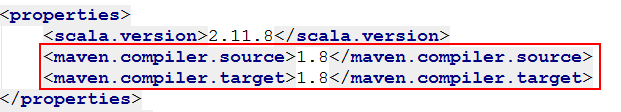

# Scala面向对象高阶

# 0. 大纲

- 继承体系
- 函数式编程

# 1. 继承体系

## 1.1. 扩展类

​	scala中的继承或者扩展和java中的差不多一样，也是用extends关键字来表示不同类之间的继承关系，extends--> A is a B, 类A是B类的一个[子]类型。使用extends关键字，子类就可以拥有父类没有被private(私有)所修饰的field和method，同时也可以拥有自己特有的field和method。

​	同时如果一个类被final修饰之后，该类则以为是一个最终类型，比如String,所以便不可被继承。

​	实际上继承类似method，是对代码的不同级别的封装，提高了代码的复用性，让类与类之间产生了关系！

```scala
object _01ExtendsOps {
    def main(args: Array[String]): Unit = {

        val stu = new Student
        stu.sid = 1L
        stu.name = "zhangsan"
        stu.age = 13

        stu.eat()

        stu.morningReading()
    }
}


/*final*/ class Person {
    /*private*/ var name:String = _
    var age:Int = _

    /*final */def eat(): Unit = {
        println("have a breakfast~~~")
    }
}

class Student extends Person {
    var sid:Long = _

    def morningReading(): Unit = {
        println(s"sid为$sid, 姓名为${name}的同学在读书")
    }
    
    //scala中如果要复写父类的一个方法，必须要使用override关键修饰，除非该方法是抽象的
    override def eat(): Unit = {
        println("have a breakfast~~~")
    }
}
```

## 1.2. 类型检查和转换

​	java中的类型检查和类型转换，检查使用instanceOf关键字来进行判别，转换使用强制类型转换。

- java的方式

    ```java
    public class Person {
        private String name;
        private int age;
    
        public Person(String name, int age) {
            this.name = name;
            this.age = age;
        }
        public String getName() {
            return name;
        }
        public void setName(String name) {
            this.name = name;
        }
        public int getAge() {
            return age;
        }
        public void setAge(int age) {
            this.age = age;
        }
        @Override
        public boolean equals(Object obj) {
            if(! (obj instanceof Person))
                return false;
            Person other = (Person)obj;
            if(this.name.equalsIgnoreCase(other.name) && this.age == other.age)
                return true;
            return false;
        }
    
        @Override
        public int hashCode() {
            return this.name.hashCode() + this.age;
        }
    }
    ```

- scala的方式

    scala中类型检查和转换的方式和java既相似又不同。所谓相似，就是基本关键字高度相似，不同就是处理方式略有差异。

    进行类型检查是对象的一个方法(a.isInstanceOf[B])，做类型转换也是对象的一个方法(a.asInstanceOf[B])

    ```scala
    object _02InstanceOfOps {
        def main(args: Array[String]): Unit = {
            val dog1 = new Dog("美丽", 2)
            val dog2 = new Dog("美丽", 2)
    
            println(dog1.equals(dog2))
        }
    }
    
    class Dog {
    
        var name:String = _
        var did:Int = _
    
        def this(name:String, did:Int) {
            this
            this.name = name
            this.did = did
        }
    
    
        def canEqual(other: Any): Boolean = other.isInstanceOf[Dog]
    
        override def equals(other: Any): Boolean = {
            var flag = false
            if(canEqual(other)){
                //类型转换
                val dog = other.asInstanceOf[Dog]
                if(this.name.equals(dog.name) && this.did == dog.did)
                    flag = true
            }
            flag
        }
    
        override def hashCode(): Int = {
           11
        }
    }
    ```

    额外的说明：

    ​	scala中对于上述的类型检查和类型转换有一种更加简洁的写法——模式匹配

    ```scala
    //模式匹配的写法
    override def equals(other: Any): Boolean = {
        other match {
            case dog:Dog => this.name.equals(dog.name) && this.did == dog.did
            case _ => false
        }
    }
    ```

- 多态

    类型检查和转换更多使用的地方就是多态：父类引用指向子类对象。

    ```scala
    val stu1:Person = new Student
    ```

## 1.3. 受保护字段和方法

​	所谓首保护的字段，就是被protected修饰的字段和方法。java中被protected修饰有啥特点？一般都是只能为子类访问，子类对象无法访问。

​	scala中和java很相似，也是子类中可以访问，子类对象无法访问。

```scala
object _03ProtectedOps {
    def main(args: Array[String]): Unit = {
        val cat = new Cat()
        cat.eat()
        val cat1 = new Cat()
        cat1.name = "tom"
        cat1.color = "gray"
        cat.makeFriend(cat1)
    }
}

class Animal {
    var name:String = _
    var color:String = _
    protected var gender:Int = 0

    def eat(): Unit = {
        println("吃")
    }
}

class Cat extends Animal {
    name = "kitty"
    color = "pink"

    override def eat(): Unit = {
        println(s"有一只颜色为${color}，性别为${gender}，的名为${name}的铲屎官在卖萌")
    }

    def makeFriend(cat:Cat): Unit = {
        println(s"有一只颜色为${color}，性别为${gender}名为${name}的喵星人要和" +
            s"另一只颜色为${cat.color}，性别为${cat.gender}名为${cat.name}的交朋友")
    }
}
```

​	但是scala提供了更加灵活的权限访问。在protected后面跟上[访问范围]

​	比如上述的gender修改为protected[this] var gender:Int = 0，这样就更加具体的指定了当前的gender的访问的范围，只能是本类及其子类中能访问。

​	所以上述makeFriend在这种情况下。cat.gender就会报错，无法范围，因为已经不再访问范围之内，是一个对象的访问！

​	同时，scala不仅仅可以在[]中写this，还可以写其它，比如：

​	protected[p4] var gender:Int = 0，这就意味，gender字段可以在包p4，及其子包下面被访问，此时上述修改之后的代码又可以正常了。

​	初次以外，scala中的主要的权限访问修饰符就有三个：

- 默认(不加)

    相当于java中public

- protected

    相当于java中的protected

- private

    相当于java中的private

    但是scala中的权限修饰符要比java中的更加灵活和精确，因为不仅仅可以在protected后面跟上[范围]，还可以在private后面跟上[范围]。

    注意：在后面学习的源码中，有很多这种写法：比如protected[this],private[spark]

## 1.4. 超类的构造

​	也就是要知道，创建子类对象的过程中，父类构造如何加载。

```scala
object _04FuConstructorProcessOps {
    def main(args: Array[String]): Unit = {
        val stu = new Student(1L)
        stu.name = "zhangsan"
        stu.age = 13
        stu.eat()

    }
}


class Person {

    println("--------Person主构造器------------")

    var name:String = _
    var age:Int = _
    def this(name:String, age:Int) {
        this
        this.name = name
        this.age = age
        println("--------Person(name:String, age:Int)辅助构造器------------")
    }
    def eat(): Unit = {
        println("have a breakfast~~~")
    }
}

class Student extends Person {
    var sid:Long = _
    println("--------Student主构造器------------")

    def this(sid:Long) {
        this()
        this.sid = sid
        println("--------Student(sid:Long)辅助构造器------------")
    }
    def morningReading(): Unit = {
        println(s"sid为$sid, 姓名为${name}的同学在读书")
    }

    override def eat(): Unit = {
        println("have a breakfast~~~")
    }
}
```

执行结果：

> --------Person主构造器------------
> --------Student主构造器------------
> --------Student(sid:Long)辅助构造器------------
> have a breakfast~~~

​	由此，我们可以分析出：

1. 在创建子类对象的时候，先加载了父类构造。
2. 子类辅助构造器，必须以this开头，去调用其它辅助构造器或者主构造器，所以子类的辅助构造器不能直接调用父类构造
3. 子类调用父类构造器只能通过主构造器来完成

子类主构造器调用父类构造器

```scala
class Student() extends Person("zhangsan", 13) {
    var sid:Long = _
    println("--------Student主构造器------------")

    def this(sid:Long) {
        this()
        this.sid = sid
        println("--------Student(sid:Long)辅助构造器------------")
    }
    def morningReading(): Unit = {
        println(s"sid为$sid, 姓名为${name}的同学在读书")
    }

    override def eat(): Unit = {
        println("have a breakfast~~~")
    }
}
```

上述代码执行过程

> --------Person主构造器------------
> --------Person(name:String, age:Int)辅助构造器------------
> --------Student主构造器------------
> --------Student(sid:Long)辅助构造器------------
> have a breakfast~~~

上述代码有个问题，给父类传递的代码写死了，需要调用的时候指定

```scala
object _04FuConstructorProcessOps {
    def main(args: Array[String]): Unit = {
        val stu = new Student("zhangsan", 13)
        stu.eat()
    }
}

class Person {
    println("--------Person主构造器------------")
    var name:String = _
    var age:Int = _
    def this(name:String, age:Int) {
        this
        this.name = name
        this.age = age
        println("--------Person(name:String, age:Int)辅助构造器------------")
    }
    def eat(): Unit = {
        println("have a breakfast~~~")
    }
}

class Student(name:String, age:Int) extends Person(name, age) {
    var sid:Long = _
    println("--------Student主构造器------------")

    def this(sid:Long) {
        this("zs", 13)
        this.sid = sid
        println("--------Student(sid:Long)辅助构造器------------")
    }
    def morningReading(): Unit = {
        println(s"sid为$sid, 姓名为${name}的同学在读书")
    }

    override def eat(): Unit = {
        println("have a breakfast~~~")
    }
}
```

执行结果：

> --------Person主构造器------------
> --------Person(name:String, age:Int)辅助构造器------------
> --------Student主构造器------------
> have a breakfast~~~

## 1.5. 匿名子类

- 概述

​	首先是一个子类，其次是匿名的。什么叫匿名？也就是没有名字的类？匿名是一个运行时创建的类，不是在源码级别创建的一类。

​	写法，就是new 类名() {};eg:

```scala
object _05AnonymousSubClassOps {
    def main(args: Array[String]): Unit = {
        val p = new Person() {
            var hairColor = "奶奶灰"
            def show(): Unit = {
                println(s"${name}---->${age}--->${hairColor}")
            }
        }
        p.show()
    }
}
```

执行结果：

> --------Person主构造器------------
> null---->0--->奶奶灰

- 局部匿名内部类

    其实匿名内部类，使用最多的就是局部匿名内部类，比如上述，main中创建的变量是局部变量，而该类优势匿名的，所以就是局部匿名内部类。

    匿名内部类使用最多的地方就是方法参数的传递。

    通过java中的动态代理设计模式来说明，匿名内部类的使用。

    代理设计模式：

    1. 静态代理

        ```scala
        //原生类
        public class Singer {
            String name;
        
            public Singer(String name) {
                this.name = name;
            }
        
            public void show() {
                System.out.println(name + "在热情高亢的卖命演唱~");
            }
        }
        //代理类 代理原生类的具体行为
        public class SingerAgent {
            private Singer singer;
        
            public SingerAgent(Singer singer) {
                this.singer = singer;
            }
        
            public void show() {
                System.out.println("出场费地域6位数面谈~~~~");
                singer.show();
                System.out.println("抽成20%~~~~");
            }
        }
        //通过代理类执行行为
        public class ShowProcess {
            public static void main(String[] args) {
                Singer singer = new Singer("蔡徐坤");
                SingerAgent sa = new SingerAgent(singer);
                sa.show();
        
            }
        }
        ```

        执行结果

        > 出场费地域6位数面谈~~~~
        > 蔡徐坤在热情高亢的卖命演唱~
        > 抽成20%~~~~

    2. 动态代理

        基于接口的动态代理

        ​	jdk提供的代理就是基于接口的动态代理，主要使用到一个类Proxy。

        ```java
        //接口
        public interface ISinger {
            public void show();
        }
        //代理过程
        public class DynimcProxyApp {
            public static void main(String[] args) {
        
                Singer singer = new Singer("蔡徐坤");
                ISinger singer1 = (ISinger)Proxy.newProxyInstance(
                        Singer.class.getClassLoader(),
                        Singer.class.getInterfaces(),
                        new InvocationHandler() {
                            /**
                             *
                             * @param proxy 被代理的对象
                             * @param method 被代理的方法
                             * @param args method执行所需要的参数
                             * @return
                             * @throws Throwable
                             */
                            @Override
                            public Object invoke(Object proxy, Method method, Object[] args)
                                    throws Throwable {
                                System.out.println("出场费地域6位数面谈~~~~");
                                Object result = method.invoke(singer, args);
                                System.out.println("抽成20%~~~~");
                                return result;
                            }
                        }
                );
                singer1.show();
            }
        }
        ```

        基于子类的动态代理

        ​	略，依赖cglib来实现

        代理的好处：静态代理的优点是清晰易懂，但是如果说业务代码很多，那么在代理类里面必须全部重新调用一遍，很麻烦。而动态代理，利用java反射机制，动态的生成了一个代理类，直接调用代理方法即可。

## 1.6. 抽象类

### 1.6.1. 简介

​	什么叫抽象？就是说相关内容不具体，话句话说就是方法也好，字段也罢，只有定义或者声明，没有实现。抽象的这个概念使我们在继承过程中，不断的向上抽取代码过程中，产生的一个概念。

​	如果子类拥有相同的行为，但是具体的实现过程不一样，比如就像，小猫和小狗都会发出叫声，具体的声线或发音不一样。所以按照面向对象的设计，就应该把小猫和小狗这一类事物向上抽取成为公共的类型Animal，将叫这一行为抽取成公共的行为，但是不同的动物发出叫声不一样，那就不适合在Animal公共父类中来做叫这个行为的具体实现。所以面向对象的做法是：只做方法的定义或声明，不做实现。这就称之为面向对象过程中的抽象的概念！

### 1.6.2. 抽象的操作

```sca
object _06AbstractOps {
    def main(args: Array[String]): Unit = {
        val dog = new Dog
        dog.shout()

        val wg = new 蜈蚣()
        wg.shout()
    }
}

abstract class Animal {
//    var leg:Int = _
    /*abstract */var leg:Int
    /*abstract*/ def shout():Unit
}

class Dog extends Animal {
    var name:String = "旺财"
    var color:String = "yellow"
    var leg = 10
    override def shout(): Unit = {
        println(name + "在汪汪汪~")
    }
}
class Cat extends Animal  {
    var name:String = "kitty"
    var color:String = "pink"
    var leg = 5

    def shout(): Unit = {
        println("喵喵喵~")
    }
}

class 蜈蚣 extends Animal {
    var leg = 100
    override def shout(): Unit = {
        println("滋滋滋~")
    }
}
```

### 1.6.3. 抽象说明

​	通过上述的案例，我们可以看见，scala中的抽象，包括了抽象的字段和方法，在定义抽象的时候有一些特点。

- 声明为抽象方法或者字段的时候，可以省略掉abstract关键字
- 只要一个类中有一个抽象字段或者抽象方法，那么该类就要声明为一个abstract的抽象类
- 子类字覆盖父类的abstract方法的时候，可以省略掉override关键字

## 1.7. trait特质

### 1.7.1. 说明

​	我们在之前的面向对象学习过程中，知道继承有一个特点：不管是java还是scala，只能单继承，不能多继承，但是可以多层继承，还可以多实现(java)。

​	scala中无法做到多继承，为了能够提高scala面向对象的扩展性，同时不能和java一模一样，于是乎设计出来了一种结果，来近似的模拟java中的接口——trait。

​	在java中多实现使用到的关键字是implements，多个接口之间用","，scala中使用extends扩展trait，多个trait之间使用with关键连接。

### 1.7.1. 特征trait操作

#### 1.7.1.1.将特质trait当做接口来对待

​	scala中的trait特质，既可以有抽象方法，抽象字段，也可以有非抽象的方法。所以如果一个trait特质中的所有的方法都是抽象的话，那么该特质可以作为java中的接口来看待。

```sca
object _07TraitOps {
    def main(args: Array[String]): Unit = {
        val log:Log = new ConsoleLog//多态写法
        val dfLog = new DailyFileLog
        val msg = "org.apache.catalina.startup.Catalina.start Server startup in 1126 ms"
        log.log(msg)
        dfLog.log(msg)
    }
}

//定义了一个特质Log
trait Log {
    def log(msg:String):Unit
}

class ConsoleLog extends Log {
    def log(msg: String): Unit = {
        println("控制台：" + msg)
    }
}

class DailyFileLog extends Log {
    val sdf = new SimpleDateFormat("yyyy-MM-dd HH:mm:ss")
    override def log(msg: String): Unit = {
        println(s"daily file >>>>time: ${sdf.format(new Date())}>>>>" + msg)
    }
}
```

#### 1.7.1.2. trait的多扩展

```scala
trait MySerializable {
    def serialize(): Unit = {
       println("进行类的序列化~~~")
    }
}
class DailyFileLog extends Log with MySerializable {
    val sdf = new SimpleDateFormat("yyyy-MM-dd HH:mm:ss")
    override def log(msg: String): Unit = {
        println(s"daily file >>>>time: ${sdf.format(new Date())}>>>>" + msg)
    }
}
```

​	也就是说，scala模拟java的多实现，就用扩展多个trait来完成，多个trait之间使用with关键字关联即可;同时trait不仅可以创建抽象方法，也可以创建非抽象方法。

#### 1.7.1.3. trait的混入

```scala
val cLog = new ConsoleLog with MySerializable//混入
cLog.serialize()
```

​	在上述的设计过程中，ConsoleLog已经扩展了Log这个trait，现在又需要添加新的功能，也就是扩展MySerializable的功能，但是源代码可以是别人开发好的，我们不可以所以修改已有的代码，那么我们又想让其具备该功能，只能使用scala的trait特质的特性——混入来完成该行为。

​	在构建该类对象的时候，动态的扩展，通过with 具体的trait实现，让该类具备被扩展的特质的性能。这样做是非侵入，而且也是松耦合。

## 1.8 枚举Enum

### 1.8.1 概念

​	所谓枚举，说白了，就是能够穷举出其中的每一个元素，在java中使用关键字enum来表示枚举。

​	在java中定义一个枚举，以交通红绿灯为例

```java
enum TrafficLight {
    RED, YELLOW, GREEN
}
```

​	在scala中，没有枚举这个结构，也就是没有enum关键字，要想创建一个scala的枚举，所以只能模拟。

### 1.8.2. 枚举的构建

```sca
object _08EnumOps {
    def main(args: Array[String]): Unit = {
        val mon = Weekday.MON
        val thu = Weekday.THU

        println("mon's id: " + mon.id)
        println("thu's id: " + thu.id)
        println("mon < thu: " + mon.<(thu))
    }
}
object Weekday extends Enumeration {
    val MON, TUE, WED, THU, FRI, SAT, SUN = Value
}
```

说明：

1. scala中枚举的id，也就是该枚举在枚举集合中的索引，从0开始
2. scala中某一个枚举的类型，不是该枚举本身，而是类名.Value

# 2. 函数式编程

# 2.1. 前言

   Java（在JDK1.8之前）是完全面向对象的编程语言，没有任何面向过程编程语言的特性，因此在Java中，一等公民是类和对象，而且只有方法的概念。Java中的方法是绝对不可能脱离类和对象独立存在的。
   而Scala是一门既面向对象，又面向函数式编程的语言。因此在Scala中有非常好的面向对象的特性；而且Scala也面向过程，因此Scala中有函数的概念。在Scala中，函数与类、对象等一样，都是一等公民。Scala中的函数可以独立存在，不需要依赖任何类和对象。

## 2.2. 函数式编程

### 2.2.1. 作为值的函数

在Scala中，函数是头等公民，就和数一样，可以在变量中存放函数。
在Scala中，有一个约定，就是将函数赋值给变量时，必须在函数后面加上空格和下划线

```scala
//作为值的函数
def functionOps1 = {
    def sayGoogBye(name:String) = {
        println("good bye, " + name)
    }
    //
    def bye = sayGoogBye _
    bye("安琪拉")

    val zj = sayGoogBye _
    zj("韦俊伟")
}
```

### 2.2.2. 匿名函数

​	没有函数名称的函数，就是匿名函数，是我们在scala函数式编程中使用最广泛的函数，没有之一！

```scala
def functionOps2: Unit = {
    val sgb = (name:String) => {
        println("good bye, " + name)
    }
    sgb("闫来宾")
}
```

### 2.2.3. 带函数参数的函数（高阶函数）

​	这里有一个函数，函数有一些参数，参数的类型是函数，函数中套函数，把这些函数称之为高阶函数，又可以称之为一个算子操作。

```scala
def functionOps3: Unit = {
	def sayGoodBye(name:String, func:(String) => Unit):Unit = {
        func(name)
	}
	sayGoodBye("刘永学", name => {println("good bye, " + name)})
}
```

### 2.2.4. 参数（类型）推断

​	参数的类型推断，主要就是基于scala的类型推断，进行代码的简化。

```scala
def functionOps4: Unit = {
    def calc(num:Int, func: (Int) => Int) = {
        val ret = func(num)
        println("ret = " + ret)
    }

    calc(5, (num:Int) => num * 2)
    //类型推断
    calc(5, (num) => num * 2)
    //如果函数参数，只有一个参数，可以省略掉这个()
    calc(5, num => num * 2)
    //可以做到最简洁，将的参数变量使用通配符"_"代替
    calc(5, _ * 2)
}
```

### 2.2.5. 常见的高阶函数

- filter

    filter(p:(src) => Boolean) 返回表达式结果为true的值

    案例：过滤数组中的奇数返回所有的偶数

    ```scala
    val ret = array.filter((num:Int) => num % 2 == 0)
    println("filter结果：" + ret.mkString(","))//Arrays.toString(arr)
    println("filter结果：" + ret.mkString("[", ", ", "]"))
    ```

- map

    map(f:(src) => dest)
    map函数的意思为：对集合中的每一个元素src，作用f匿名函数，生成一个新的元素dest
    这些新的dest组合成为一个新的集合

    src ===> dest的操作
    1 ： 1/one-2-one的操作

    案例：将数组中的每一个元素变为原来的一半

    ```scala
    val array = Array(1, 2, 3, 4, 5)
    //        for(i <- array) {
    //            i * 0.5
    //        }
    val dRet = array.map((num) => num * 0.5)
    println("map结果：" + dRet.mkString("[", ", ", "]"))//Arrays.toString(arr)
    ```

    


### 2.2.6. 闭包
### 2.2.7. 柯里化
### 2.2.8. return表达式

## 2.3. scala集合框架


# 3. 补充知识

## 3.1. 命名规范：

1. 类名：首先为名词，其次是单数形式；如果类名有多个单词构成，驼峰命名，并且首字母大写
2. 方法/函数名：一般都为动宾短语(动词+名词)；如果类名有多个单词构成，驼峰命名，并且首字母小写
3. 不管是类名还是方法/函数名，一般情况下不建议使用下划线或者数字

## 3.2. 关于jdk编码语言版本的问题


​	经常会出现如上图所示的问题，主要原因在于sdk版本过低，两种修改方式，临时修改和彻底修改。

- 临时修改

    

       但是这种方式有问题，是临时的修改，只要pom文件发生变化，代码重新编译之后，又会退出去，还是报错，所以一般不用。

- 彻底修改

    ​	一劳永逸的解决，有两个地方修改，都是在pom文件中处理。

    1. 在properties中修改

        

        ```xml
        <properties>
            <scala.version>2.11.8</scala.version>
            <maven.compiler.source>1.8</maven.compiler.source>
            <maven.compiler.target>1.8</maven.compiler.target>
        </properties>
        ```

    2. 在build中添加插件搞定

        ```scala
        <build>
            <plugins>
                <plugin>
                    <artifactId>maven-compiler-plugin</artifactId>
                    <configuration>
                        <source>1.8</source>
                        <target>1.8</target>
                    </configuration>
                </plugin>
            </plugins>
        </build>
        ```

        