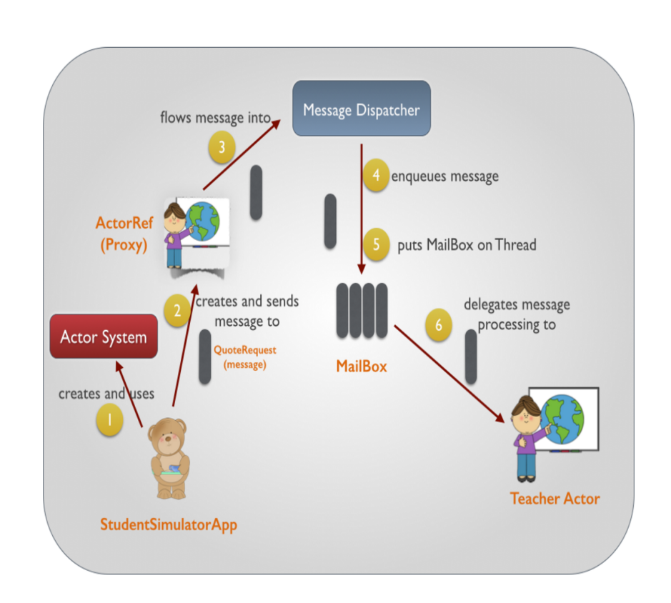

# scala高级函数式编程

## 1. 模式匹配

## 1.1. 引言

	1、模式匹配是Scala中非常强大的一种功能。模式匹配，其实类似于Java中的swich case语法，即对一个值进行条件判断，然后针对不同的输入条件，进行结果处理。
	2、Scala的模式匹配的功能比Java的swich case语法的功能要强大地多，Java的swich case语法只能对值进行匹配。但是Scala的模式匹配除了可以对值进行匹配之外，还可以对类型进行匹配、对Array和List的元素情况进行匹配、对case class进行匹配、甚至对有值或没值（Option）进行匹配。

## 1.2. 模式匹配实战

### 1.2.1. 可以用到Switch语句中

1、Scala强大的模式匹配机制，可以应用在switch语句、类型检查以及“析构”等场合。

	case _模式对应于switch语句中的default，能够捕获剩余的情况。如果没有模式能匹配，会抛出MatchError。而且不像常见的switch语句，在一种模式匹配之后，需要使用break来声明分支不会进入下一个分支。
2、match是表达式，不是语句，所以是有返回值的。

```scala
/*
        使用模式匹配模拟java中的switch-case语法结构
        在控制台输入一个简单四则运算表达式，并进行求解
        比如：2 + 1 => 3

        在使用模式匹配的时候，如果没有对所有的可能性进行匹配的话，会报错，scala.MatchError
     */
def matchOps1(): Unit = {
    println("四则运算表达式:")
    println("左侧表达式：")
    val left = StdIn.readInt()
    println("操作符表达式：")
    val operator = StdIn.readChar()
    println("右侧表达式：")
    val right = StdIn.readInt()

    val res = operator match {
        case '+' => left + right
        case '-' => left - right
        case '*' => left * right
        case '/' => left / right
        //相当于java中的default，对其余可能性的匹配处理
        case _ => left % right
    }

    println("计算结果为： " + res)
}
```

### 1.2.2. 守卫

```scala
//守卫 yield
def matchOps2: Unit = {
    val list = 1 to 10

    val ret = for(i <- list if i % 2 == 0) yield {i}
    println(ret)

    val res = if(list.isEmpty) "heihe" else "haha"
    println(res)
}
```

### 1.2.3. 模式中的变量

```scala
try {
    //val lines = Source.fromFile("ffffff")
    //val i = 1 / 0
    throw new RuntimeException
} catch {
    case fnfe: FileNotFoundException => {
        println("fnfe: " + fnfe.getMessage)
    }
    case ar:ArithmeticException => {
        println("arch: " + ar.getMessage)
    }
    case _ => {
        println("default")
    }
}
println("------------")
"Hello, world" foreach { c => println (
    c match {
        case ' ' => "space"
        case ch => "Char: " + ch
    }
)}
```

### 1.2.4. 类型模式

	相比使用isInstanceOf来判断类型，使用模式匹配更好。

```scala
def typeOps(x:Any): Unit = {
    val ret = x match {
        case i:Int => i
        case str:String => str.toUpperCase()
        case z:scala.math.BigInt => Int.MaxValue
        case c:Char => c.toInt
        case _ => 0
    }
    println("ret: " + ret)
}

typeOps(1)
typeOps("abcefg")
typeOps('a')
```

### 1.2.5. 匹配数组、列表和元组

```scala
def matchOps5: Unit = {
    val array = Array(-1, 1, 0)
    array match {
        //            case Array(x, y) => {//匹配当前数组长度为2
        //                println(s"x:$x, y: $y")
        //            }
        case Array(-1, _ *) => {//匹配当前数组的第一个元素为-1，长度不限
            println(array.mkString("[", ", ", "]"))
        }
    }
}
```

### 1.2.6. 样例类

	样例类，case class，主要作用就是在scala中携带数据，充当java中bean的作用。

1. 样例类是种特殊的类，经过优化以用于模式匹配。

2. Scala中提供了一种特殊的类，用case class进行声明，中文也可以称作样例类。case class其实有点类似于Java中的JavaBean的概念。即只定义field，并且由Scala编译时自动提供getter和setter方法，但是没有method。

3. case class的主构造函数接收的参数通常不需要使用var或val修饰，Scala自动就会使用val修饰（但是如果你自己使用var修饰，那么还是会按照var来）

4. Scala自动为case class定义了伴生对象，也就是object，并且定义了apply()方法，该方法接收主构造函数中相同的参数，并返回case class对象

```scala
/**
 * 一次性输入三个值，
 * 三个表达式：left  中  →
 * 用，隔开
 */
def matchOps7(): Unit = {
    case class Expression(left:Double, opeator:String, right:Double)
    
    val line = StdIn.readLine("四则运算表达式:")
    val fields = line.split(",")
    val left = fields(0).trim.toDouble
    val operator = fields(1).trim
    val right = fields(2).trim.toDouble

    val expr = Expression(left, operator, right)

    val ret = expr match {
        case Expression(left, "+", right) => left + right
        case Expression(left, "-", right) => left - right
        case Expression(left, "/", right) => left / right
        case Expression(left, "*", right) => left * right
    }
    println("ret = " + ret)
}

def matchOps6: Unit = {

    abstract class Expr

    case class Var(name:String) extends Expr

    case class UnOp(operator:String, expr:Expr) extends Expr

    case class BinOp(left:Expr, operator:String, right:Expr) extends Expr

    def caseClassOps(expr:Expr) = {
        expr match {
            case Var(name) => println("Var: " + name)
            case UnOp("+", Var(name)) => println("UnOp: " + name + "+")
            case BinOp(Var(left), "-", Var(right)) => println("BinOp => " + (left.toInt - right.toInt))
            case _ => println("去死吧~")
        }
    }
    caseClassOps(BinOp(Var("1"), "-", Var("101")))
}
```

### 1.2.7. 模拟枚举

可以使用样例类来模拟枚举类型：
   当使用样例类来做模式匹配时，如果要让编译器确保已经列出所有可能的选择，可以将样例类的通用超类声明为sealed。
   密封类的所有子类都必须在与该密封类相同的文件中定义。
   如果某个类是密封的，那么在编译期所有的子类是可知的，因而可以检查模式语句的完整性。
   让所有同一组的样例类都扩展某个密封的类或特质是个好的做法。

```scala
def matchOps9: Unit = {

    sealed abstract class TrafficLightColor

    case object GREEN extends TrafficLightColor
    case object YELLOW extends TrafficLightColor
    case object RED extends TrafficLightColor

    def tips(light:TrafficLightColor): Unit = {
        light match {
            case RED => println("行车不规范，亲人两行泪")
            case YELLOW => println(
                "骑摩托车的请带好头盔，否则让开宝马车的同学看见，略显感概"
            )
            case GREEN => println("开车不喝酒，喝酒不开车，还要远离女司机~")
        }
    }
    tips(GREEN)
}
```


### 1.2.8. Option

	Option是可选的值，有两种可能，要么有值(Some)，要么没有值(None).

```scala
sealed abstract class Optition
case class Some extends Option
case object None extends Option
```

```scala
def matchOps8: Unit = {
    val capitals = Map(
        "France" -> "Paris",
        "Japan" -> "Tokyo Hot",
        "Russia" -> "Moscow"
    )

    val capital:Option[String] = capitals.get("Russia")
    capital match {
        case Some(city) => println(city)
        case None => println("这个真没有~")
    }

    println( capitals.getOrElse("India", "爪哇岛"))
}
```


## 2. 类型参数

### 2.1 简介

> Scala中的类型参数，就是Java中的泛型，广泛类型，在程序编译或源码阶段，对数据的类型进行限定约束，只能是某种类型，主要是安全角度进行考虑，但是在运行中擦除泛型
>
> 泛型的主要作用，就是将运行时的异常，提前到了编译器，加强了代码的安全性
>
> 在Java中定义泛型的时候，使用<>来包含，泛型在定义的时候可以使用任意的标识符，但通常不可以使用数字。泛型在类、方法上面都可以定义
>
> 在Scala中拥有通用的借口，Scala中叫做类型参数，也可以定义在类or方法上面;表示方法和Java中有所差异。Scala中用\[ ]表示。
>
> 同时更重要的是，Scala中的泛型比Java中的泛型灵活强大的多

### 2.2 泛型类

> 所谓泛型类，就是在类的声明或者定义的时候，执行数据类型，在类上面定义的泛型，可以在类的任何地方使用

```scala
class Student(first:String, second:String){
    def show(): Unit ={
        println("first:"+first+"\tsecond:"+second)
    }
}

class Student1(first:Int, second:Int){
    def show(): Unit ={
        println("first:"+first+"\tsecond:"+second)
    }
}

class Student2(first:Any, second:Any){
    def show(): Unit ={
        println("first:"+first+"\tsecond:"+second)
    }
}

class Student3[T](first:T, second:T){
    def show(): Unit ={
        println("first:"+first+"\tsecond:"+second)
    }
}

class Student4[T,S](first:T, second:S){
    def show(): Unit ={
        println("first:"+first+"\tsecond:"+second)
    }
}
```

### 2.3 泛型函数

> 除了在类上面定义泛型，还可以在方法上面定义泛型，Java中 `public static <T> void method()`
>
> 在Scala中，

### 2.4 类型变量界定

类型变量的界定，在Java中有泛型的上限界定，下限界定。

```scala
class Student[T <: Comparable[T]](val first: T, val second: T){
     def smaller = if (first.compareTo(second) < 0) first else second
   }

    val studentString = new Student[String]("jack","john")
    println(studentString.smaller)

    val studentInt = new Student[Integer](1,2)
    println(studentInt.smaller)
```

> 注意，这相当于是对类型T加了一条限制：T必须是Comparable[T]的子类型。原来给T指定什么类型都可以，现在就不行了。
> 你也可以为类型指定一个上界。
> 这样一来，我们可以实例化Student[String]。但是不能实例化Student[File]，因为String是Comparable[String]的子类型，而File并没有实现Comparable[File]接口


### 2.5 视图界定


### 2.7 协变和逆变

- 在Java中，等号左右两侧的泛型是不可以有继承关系的
- 在Scala中，默认情况下和Java的定义一模一样，不允许左右两侧泛型是继承关系；

```scala
class List[+T](val head: T, val tail: List[T]) {
    //将函数也用泛型表示
    //因为是协变的，输入的类型必须是T的超类
    def prepend[U>:T](newHead:U):List[U]=new List(newHead,this)

    override def toString()=""+head
}

val list:List[Any]= new List[String]("摇摆少年梦",null)
println(list)
```

### 2.8 通配符

```scala
//类型通配符是指在使用时不具体指定它属于某个类，而是只知道其大致的类型范围，通过”_ <:” 达到类型通配的目的
def typeWildcard: Unit ={
    class Person(val name:String){
        override def toString()=name
    }
    class Student(name:String) extends Person(name)
    class Teacher(name:String) extends Person(name)
    class Pair[T](val first:T,val second:T){
        override def toString()="first:"+first+", second: "+second;
    }
    //Pair的类型参数限定为[_<:Person]，即输入的类为Person及其子类
    //类型通配符和一般的泛型定义不一样，泛型在类定义时使用，而类型能配符号在使用类时使用
    def makeFriends(p:Pair[_<:Person])={
        println(p.first +" is making friend with "+ p.second)
    }
    makeFriends(new Pair(new Student("john"),new Teacher("摇摆少年梦")))
}
```


## 3. 隐式转换

> 1、Scala默认会考虑两种隐式转换，一种是源类型，或者目标类型的伴生对象内的隐式转换函数；一种是当前程序作用域内的可以用唯一标识符表示的隐式转换函数。
>
> 2、如果隐式转换不在上述两种情况下的话，那么就必须手动使用import语法引入某个包下的隐式转换函数，比如import student._。

```scala
def main(args: Array[String]): Unit = {
    /*
		* 隐式转换，由隐士函数来实现
		* 与普通函数区别：
		* 	1、必须以implicit开头
		* 	2、必须有返回值，返回值类型就是要转换的类型
		* 	3、定义隐式转换函数的时候，通常命名规则：src2Dest
		*/

    implicit def double2String (d:Double):String = d.toString
    val str:String = 3.5
}
```

#### 隐式函数调用

1、隐式转换可以定义在目标文件当中(一个Scala文件中)
//转换函数
`implicit def double2Int(x:Double)=x.toInt
val x:Int = 3.5`

2、隐式转换函数与目标代码在同一个文件当中，也可以将隐式转换集中放置在某个包中，在使用进直接将该包引入即可
`import java.io.File
import scala.io.Source`


## 4. Actor\AKKA Actor V.S. RPC

> 研究的是线程间或进程间的通信方式；在Java总做分布式的系统或者比较复杂的需要用到客户端和服务端之间的进程间的交互的程序，就需要涉及到进程的通信。进程间的通信方式非常多，总体上目前比较流行的集中处理方式；

- HTTP
    - 著名案例：SpringCloud微服务
    - 好处：跨语言，跨平台，灵活
    - 不足：携带数据体积较大，相对于RPC传输的效率较低
- RPC
    - 著名案例：Hadoop、Hbase、Kafka、Spark、Dubbo等
    - 适用于大型程序，相比较http，去除了大量的http请求头、响应头等信息，传输效率更高
    - 仅限于JAVA生态
- PMI
    - JDK自带一套进程间通信方式
- WebService
    - 也是较著名的进程间调用的架构。
    - 常见操作，将自己服务中的某些服务开发给其他的程序进行调用，例如天气信息等；
- Thrift

> 上述进程间的通信，底层的架构都是基于TCP\IP来实现的

### 4.1 RPC

> prc其实是IPC的中的一种，

#### 4.1.1 LPC

- LPC（Location produce call），本地进程间线程调用

#### 4.1.2 RPC

- **RPC**（Remote produce call），远程进程间调用


### 4.2 Actor

#### 4.2.1 

```scala
object _01ActorOps {
	def main(args: Array[String]): Unit = {
		val helloActor = new HelloActor

		helloActor.start()

		//发送线程消息
		helloActor ! "Hello"
		helloActor ! 5

	}
}

class HelloActor extends Actor {
	override def act(): Unit = {
		while (true) {
			//接收消息，有阻塞，没有消息就会发送blocking
			receive {
				case str: String => {
					println("str: " + str)
				}
				case i: Int => println(i)
			}
		}
	}
}
```

#### 4.2.3 基于case class 来进行传递

> 上述案例中，虽然能够完成通信，但是通信的数据格式单一，表达含义有限，所有工作过程中一般都是用java-bean或者case class来传递更加丰富的数据信息；

```scala
//基于case class通信案例
object _02ActorOps {
	def main(args: Array[String]): Unit = {
		val heyActor = new HeyActor
		heyActor.start()
		//发送线程消息
		heyActor ! Morning("早晨——～～")
		heyActor ! MorningMetting("项目启动。。。")
	}
}

case class Morning(hello:String)
case class MorningMetting(content:String)


class HeyActor extends Actor {
	override def act(): Unit = {
		while (true) {
			//接收消息，有阻塞，没有消息就会发送blocking
			receive {
				case Morning(hello) => {
					println("hello: " + hello)
				}
				case MorningMetting(content) =>{
					println("let's talk about sth. with "+content)
				}
			}
		}
	}
}
```

#### 4.2.4 相互通信

> 本案例是在上述两个案例的基础上，进行线程间的通信


### 4.3 AKKA Actor

#### 4.3.2 依赖

```xml
<dependency>
    <groupId>com.typesafe.akka</groupId>
    <artifactId>akka-actor_2.12</artifactId>
    <version>2.5.25</version>
</dependency>


```



#### 4.4 互相通信

> 学生向老师问问题，老师给予回复